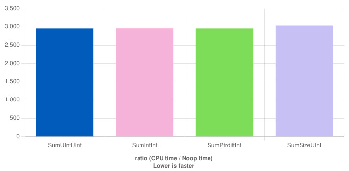
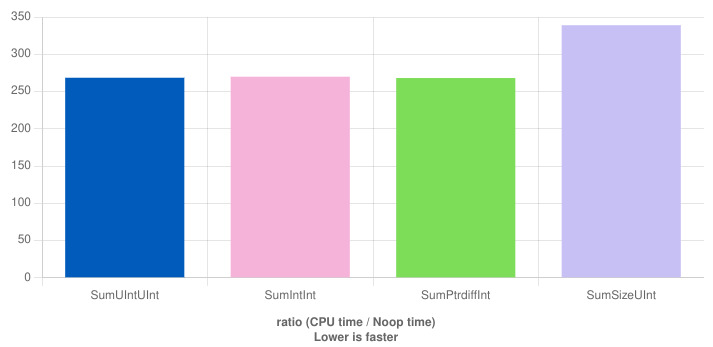

(
TODO
Trade-off: should errors lead to obvious incorrect application behavior (crash, infinite loop, failed assert, or similar) or should the application do the best it can and keep running?
An obvious error means that we can fix our code, but if we don't  handle it properly we risk security vulnerabilities.
)

(
TODO
Consider structuring the note as a sequence or functions to implement and ways of implementing it.
Then compare which work with signed and which work with unsigned.
If more examples don't work with either type then that type is more error-prone.
)

(
TODO
Rewrite the sectioning to not be pros/cons signed/unsigned since there is too much repetition.
Instead describe one use-case / concept at the time and evaluate the consequences with signed and unsigned integers together.
This makes it easier to place considerations that doesn't fit neatly into a pro or con for either of them, such as the `auto mid = (low + high) / 2`  discussion in [25](https://graphitemaster.github.io/aau#computing-indices-with-signed-arithmetic-is-safer), and others in the same text.
)


(
TODO 
Find where to put the following loop, demonstrating division in the index calculation.
```cpp
void work(
	Container& container,
	integer_t base_index,
	Container<std::ptrdiff_t>& byte_offsets,
	integer_t element_size)
{
	for (integer_t byte_offset : byte_offsets)
	{
		integer_t index = base_index + (byte_offset / element_size);
		// Work with container[index].
	}
}
```
)

(
TODO
Find where to put the following loop, demonstrating iterating over a sub-range [(28)](https://gustedt.wordpress.com/2013/07/15/a-praise-of-size_t-and-other-unsigned-types/).
```cpp
void work(Container& container, std::ptrdiff_t start_skip, std::ptrdiff_t end_skip)
{
	for (integer_t index = start; index < container.size() - end_skip; ++index)
	{
		// Work with contianer[index].
	} 
}
```

The above fails for unsigned index when `end_skip > container.size()` because `container.size() - end_skip` underflows, producing a very large number, and the loop will visit not only container elements at the end that should be skipped,
it also buffer overruns.
With an unsigned index we must first check that we shouldn't skip the entire loop.
```cpp
void work(Container& container, integer_t start_skip, integer_t end_skip)
{
	if (end_skip >= container.size())
		return;

	for (integer_t index = start; index < container.size() - end_skip; ++index)
	{
		// Work with contianer[index].
	} 
}
```

The initial `std::ptrdiff_t` loop fails if `start_skip` or `end_skip` is negative,
since that will cause it to index out of bounds of the container.

An even simpler, and I guess more common, variant is to visit all but the last element of a container [(57)](https://www.reddit.com/r/cpp/comments/rtsife/almost_always_unsigned).
```cpp
void work(Container& container)
{
	for (integer_t index = 0; index < container.size() - 1; ++index)
	{
		// Work with container[index].
	}
]
```

This fails with unsigned integers for empty containers [(68)](https://github.com/ericniebler/stl2/issues/182) while with signed integers it works as expected.
With unsigned, `container.size() - 1` becomes `0 - 1` which wraps around to a very large number, which causes the loop to run too many iterations.
We can fix the empty container case with unsigned integers by checking for the empty container case before starting the loop.
Being explicit about precondition and handling special cases separately if often a good idea [(68)](https://github.com/ericniebler/stl2/issues/182).
It forces us to write more straight-forward code with less "trickery", which means that is is easier to understand and easier to get right.
```cpp
void work(Container& container)
{
	if (container.empty())
	{
		return;
	}

	for (std::size_t index = 0; index < container.size() - 1; ++index)
	{
		// Work with container[index].
	}
]
```
Or we can move the offset to the other side of the comparison:
```cpp
void work(Container& container)
{
	for (std::size_t index = 0; index + 1 < container.size(); ++index)
	{
		// Work with container[index].
	}
]
```
The guideline is to not use subtraction with unsigned integers.
Instead use the algebraic rules to rewrite all expressions to use addition instead.
Not sure if that is always possible.
(
TODO Find a counter-example.
)

A signed `integer_t` doesn't save us here if `Container` is an `std::vector` since the problem is because `std::vector::size` has an unsigned return type.
We must either explicitly check for the empty container case or make sure the end-of-range computation is done using a signed type.
```cpp

// Handle empty container separately before the loop.
template <typename T>
void work(std::vector<T>& container)
{
	if (container.empty())
		return;

	for (integer_t index = 0; index < container.size() - 1; ++index)
	{
		// Work with container[index].
	}
}

// Use std::ssize instead of .size().
template <typename T>
void work(std::vector<T>& container)
{
	for (std:ptrdiff_t index = 0; index < std::ssize(container) - 1; ++index)
	{
		// Work with container[index].
	}
}

// Cast the size before the subtraction.
template <typename T>
void work(std::vector<T>& container)
{
	for (std:ptrdiff_t index = 0;
		index < static_cast<std::ptrdiff_t>(container.size()) - 1;
		++index)
	{
		// Work with container[index].
	}
}
```

Another variant is to not do the subtraction at all, and instead do addition on the other size of the less-than operator.
```cpp
void work(Container& container)
{
	for (integer_t index = 0; index + 1 < container.size(); ++index)
	{
		// Work with container[index].
	}
}
```
)


(
TODO
Find where to put the following, demonstrating unexpected widening [(31)](https://critical.eschertech.com/2010/04/07/danger-unsigned-types-used-here/).
This is similar to _Impossible To Detect Underflow_, but we compute the large value instead of being given it.
```cpp
std::uint32_t a {10};
std::uint32_t b {11};
std::int64_t c = a - b;
// c is now std::numeric_limits<std::uint32_t>::max() despited being stored
// in a signed variable. The problem is that we change the size. Had both
// been 32-bit or 64-bit then it would have been fine.
```
)


(
TODO
Find where to put the following, demonstrating that we cannot compute distances between values like normally would when using unsigned integers.

This looks like it would give us the distance between `v1` and `v2`,
and in some sense it does,
but it doesn't give the shortest distance and the `std::abs` will trigger a compiler error [(32)](https://stackoverflow.com/questions/47283449/should-signed-or-unsigned-integers-be-used-for-sizes).
```cpp
void work(std::size_t v1, std::size_t v2)
{
	std::size_t distance = std::abs(v1 - v2);
}
```
The problem is that `v1 - v2`, with unsigned `v1` and `v2`, produces an unsigned result.
If `v1 < v2` then we wrap around and get a very large positive value.
The distance from `v2` to `v1` if we start walking away from `v1`, hit the upper bound, wrapped back down to zero, and finally continued on to `v1`.
This is probably not what was intended.
The `std::abs` doesn't save us because by the time the argument has been computed we already have a too large value, since the expression cannot ever be negative.
Also, `std::abs` doesn't make any sense for an unsigned type since if we were to implement it it would be the identity function.
For this reason the standard library designers opted to not provide that overload,
giving a compiler error to inform us that we are probably not doing what we thing we are doing.
One way to compute the distance is `std::max(v1, v2) - std::min(v1, v2)`.

With signed integers the original computation works as intended.
```cpp
void work(std::ptrdiff_t v1, std::ptrdiff_t v2)
{
	std::ptrdiff_t distance = std::abs(v1 - v2);
```
)


The purpose of this note is to evaluate the advantages and disadvantages of using signed or unsigned integers, mainly for indexing operations.
Both variants work and all problematic code snippets can be fixed using either type.
They are what multiple authors and commentators could call "bad code, bad programmer".
Both families of types have problem areas and errors can occur with both [(34)](https://youtu.be/Fa8qcOd18Hc?t=3080).
The aim has been to find examples where the straight-forward way to write something produces unexpected and incorrect behavior.
If what the code says, or at least implies after a quick glance, isn't what the code does then there is a deeper problem than just "bad code, bad programmer".
We are not content with having the code being correct when we first check it in, we also want it to remain correct through multiple rounds of modifications by multiple people.
Real-world programmers writing real-world programs tend to have other concerns in mind than the minutiae of implicit integer conversion rules and overflow semantics.
What we want to do is reduce the number of ways things can go wrong, reduce the fallout of an errant process, and minimize cognitive load to reduce bugs overall [(62)](https://news.ycombinator.com/item?id=29766658).
We want tools, language and compiler included, that help us prevent errors [(29)](https://stackoverflow.com/questions/30395205/why-are-unsigned-integers-error-prone).

For this discussion we assume a 64-bit machine with 32-bit `int`.
Some results are different on other machines.

Fixed sized integer types, which all primitive integer types are, have the drawback that they can only represent a limited range of values.
When we try to use them outside of that range they wrap, trap, saturate, or trigger undefined behavior [(27)](https://blog.regehr.org/archives/1401).
In most cases none of these produce the result we intended, and often lead to security vulnerabilities [(34)](https://www.youtube.com/watch?v=Fa8qcOd18Hc), with exceptions for algorithms that explicitly need wrapping behavior such as some encryption algorithms.
A signed integer type is one that can represent both positive and negative numbers, and zero.
An unsigned integer is one that can only represent positive numbers, including zero.
The purpose for this note is to explore the pros and cons of using each in cases where it is not obvious, such as for sizes and indexing.
There is no universally agreed upon choice.
The options are permutations of:
- Integer signedness.
	- Use unsigned wherever a value should never be negative.
	- Use signed even when a value should never be negative, including indices.
- Whether to use `-Wsign-conversion` or not.
- Whether to cast signed → unsigned every time we use a standard library container.
- Whether to wrap standard library containers in sign-ness-changing views.

We can have different priorities when making this decision, and put different weight one each from project to project.
- Robustness: It should be difficult to write bugs and easy to identify them when they happen
- Readability: The code should makes sense. What ever that means.
- Runtime performance: The code should execute as fast as possible.
- Memory usage: Always use the smallest type possible.
- Avoid undefined behavior.
- Undefined behavior on error: It is diagnosable with an undefined behavior sanitizer.
	- Though being undefined behavior means the compiler may do unexpected transformations to our code, meaning that the overflow might not actually happen at runtime. Instead the application does something completely different.

(
TODO For each advantage / disadvantage describe how it affects the priorities listed above.
)

In this note `integer_t` is an integer type that is an alias for either `std::size_t` or `std::ptrdiff_t` depending on if we use signed or unsigned indexing.
`std::size_t` is an unsigned integer large enough to hold the size of any object,
including heap allocated buffers.
`std::ptrdiff_t` is a signed type used to represent the difference between two pointers.
It is "meant" to be large enough to hold the difference between any two pointers pointing within the same object, but that isn't necessarily true since `std::size_t` and `std::ptrdiff_t` typically have the same size and if we have an object with size `std::numeric_limits<std::size_t>::max()` and a pointer to the first byte and a pointer to the last byte then `std::numeric_limits<std::ptrdiff_t>::max()`  is smaller than the difference between them.
(
Is there any difference between `intptr_t` and `std::ptrdiff_t`?
On some machines it is, such as those with segmented memory.
Most modern machine have a flat memory address space.
)
In this note `Container` represents any container type that has `std::size_t size() const` and `T& operator[](size_t)` member function, for example `std::vector`.
In this note, `isValidIndex` is the following overloaded function, unless context makes it clear that something else is meant:
```cpp
template <typename Container>
bool isValidIndex(const Container& container, std::size_t index)
{
	return index < container.size();
}

template <typename Container>
bool isValidIndex(const Container& container, std::ptrdiff_t index)
{
	// Negative indices are never valid.
	if (index < 0)
	{
		return false;
	}

	// Sanity check of the container, _probably_ not necessary.
	// Can the below error report ever trigger?
	const std::size_t max_possible_index =
		static_cast<std::size_t>(std::numeric_limits<std::ptrdiff_t>::max());
	if (container.size() > max_possible_index)
	{
		report_error("Container too large for signed indexing");
	}

	return index < std::ssize(container);
}
```

In this note the words "mathematical results" means the result of an arithmetic operation interpreting all values as being in ℤ, the infinite number line of integers in both directions.
I know that the ℤ/n ring is also "mathematics" but I don't care, it is not what we usually intent when talking about counts, sizes, and offsets and not the topic if this note even though its effects will be painfully experienced.

In this note "arithmetic underflow" refers to an arithmetic operation that should produce a result that is smaller than the smallest value representable by the return type.
For a signed type that is some large negative value.
For an unsigned type that is 0.

"Arithmetic overflow" refers to an arithmetic operation with an unrepresentable result, just like underflow, but at the high end of the integer type's range instead of the low end.

Signed numbers are not allowed to overflow or underflow, that is [[Undefined Behavior]].
Unsigned numbers are allowed to overflow and underflow, they wrap around.
This is called modular arithmetic.
From a language specification standpoint this isn't under- or overflow at all,
it is just the way these types work.

Because overflow of signed integers is undefined behavior the compiler does not need to consider this case when generating machine code.
This can in some cases produce more efficient code (`citation needed`).

Since there are a number of bugs stepping from unintended conversions between signed and unsigned integer types many compilers include warnings for this, often enabled with `-Wconversion`, `-Wsign-conversion`, and/or `-Wsign-compare`.

It has been difficult to find or come up with good illustrative examples that demonstrates the various problems described in this note.
Examples are often trivial and hard to map to real-world production code.

A problem is that signed and unsigned expresses multiple properties and it is not always possible to get the exact combination that we want.
- Modular arithmetic / wrapping.
- Value may only be positive.
- Value can be negative.
- Over / underflow not possible / not allowed.

# Dangers

- Implicit type conversions with unexpected results happening in unexpected places.
- Under- or overflow resulting in undefined behavior.
- Unexpected or unintended wrapping.
- Comparing signed and unsigned.

When we say that some arithmetic operation produced an unexpected result we don't mean that it is unexpected that fixed-width integers wrap at the ends of  the type's range,
we mean that it was unexpected that this particular operation reached that end.

## Implicit Conversions

C++ has counter intuitive, and numerically incorrect, implicit conversion rules.
A combination of promotions [(50)](https://eel.is/c++draft/conv.prom) and usual arithmetic conversions [(48)](https://en.cppreference.com/w/cpp/language/usual_arithmetic_conversions),  [(49)](https://eel.is/c++draft/expr.arith.conv).
This is unfortunate, a compiler error would be better [(68)](https://github.com/ericniebler/stl2/issues/182).

### Integer Promotions

C++ does all integer arithmetic using types that are at least as wide as `int`.
If you try to add, or do any other arithmetic operation on, two variables whose types are smaller than `int`, such as two `int8_t`, then the values will first be promoted to `int` or `unsigned int` if `int` cannot hold all values of the source type  [(47)](https://blog.libtorrent.org/2016/05/unsigned-integers/).
This makes expressions involving small types work as expected even when intermediate results are outside the range of the source type since intermediate results are allowed to go beyond the range of the original type without issue as long as they stay within the range of `int` or `unsinged int` [(51)](https://wiki.sei.cmu.edu/confluence/display/c/INT02-C.+Understand+integer+conversion+rules).
```cpp
int8_t c1 = 100;
int8_t c2 = 3;
int8_t c3 = 4;
int8_t result = c1 * c2 / c3;
```
In the above example `c1 * c2` is larger than `std::numberic_limits<int8_t>::max()`, but that's OK since it is smaller that `std::numeric_limits<int>::max()`, and the actual computation is done with `int`.
The division by `c3` brings the value down into the range of `int8_t` again and all is well.

This conversion only happens up to the size of `int`.
If you do the same operations where `c1`, `c2`, and `c3` are all `int` and the initial values chosen so that the `c1 * c2` multiplication overflows then your application is toast, as you have invoked undefined behavior.

### Usual Arithmetic Conversions

Arithmetic operations are always performed on two values of equal type [(49)](https://eel.is/c++draft/expr.arith.conv).
If two different types are passed to an operator then they are converted to a common type.
This process is called the usual arithmetic conversions.
There are many steps involved in deciding which type to use, but in short:
- The widest type wins.
- If they are the same width, then unsigned wins.

If you multiply an `int` and an `int64_t` then the computation will be performed using `int64_t`.
If you multiply an `int` and an `unsigned int` then the computation will be performed using `unsigned int`.
This can wreck havoc with your application since the usual arithmetic conversions happens not only for addition and multiplication and such, but also for comparison operators.
That is, -1 is greater than 1 if 1 is unsigned [(47)](https://blog.libtorrent.org/2016/05/unsigned-integers/).
```cpp
int small = -1
unsigned int large = 1;
if (small < large)
{
	// This will never execute even though in the real world
	// -1 absolutely is smaller than 1.
}
```

The usual arithmetic conversions don't require two operands, it applies also to unary operators.
Consider
```cpp
uint8_t a = 1; // 0000'0001.
~a; // We might think this is 1111'1110.
    // But it is actually 1111'1111'1111'1111'1111'1111'1111'1110.
```

Another example [(57)](https://www.reddit.com/r/cpp/comments/rtsife/almost_always_unsigned):
```cpp
int revenue = -5;            // can be negative when loss, so signed
unsigned int taxRefund = 3;  // cannot be negative, so unsigned
cout << "total earnings: " << revenue + taxRefund << endl;
```
Output:
```
total earnings: 4294967294
```
We get a very large value because in the addition we mix signed and unsigned.
The signed value is converted to unsigned and since it is negative we get a very large value.
In particular, we get a value that is 4 lower than `std::numeric_limits<unsigned int>::max()`.
Then 3 (`taxRefund`) is added and we end up 1 (4 - 3) away from the max.

## Integer Wrapping And Over- / Underflow

Wrapping is the act of truncating away the bits beyond those supported by the type we are using.
If you add 1 to the largest value an unsigned integer type can hold then the value doesn't become one larger, it wraps around back to zero.
Similarly, if you subtract one from an unsigned zero you don't get -1, instead the value wrap around to the largest value the type supports.
This violates our intuition of regular arithmetic [(47)](https://blog.libtorrent.org/2016/05/unsigned-integers/), especially when it happens with intermediate results.
There is a discontinuity in the value range where we teleport from one place on the number line to another.
This means we can no longer depend on regular algebraic rules.
```cpp
int32_t a = -2;
uint32_t b = 4;
int32_t c = 2;
int32_t d = (a - b) / c + 10;
```
Let's evaluate the above using regular algebraic rules.
- (-2 - 4) / 2 + 10
- (-6) / 2 + 10
- -3 + 10
- 7

Unfortunately, this is not what happens.
The unsigned `b` taints the entire expression due to the usual arithmetic conversions.
So `(a - b)` isn't -6, it's 4294967293.
And the rest of the computation is just garbage.
It doesn't help that `b` represents a value that "can never be negative", it still causes problems.

This types of weirdness can limit the optimizer [(47)](https://blog.libtorrent.org/2016/05/unsigned-integers/).
If we put the above code into a function, making some of the values parameters and other compile time constants, we get the following:
```cpp
int32_t work(uint32_t b)
{
	int32_t a = -2;
	int32_t c = 2;
	int32_t d = (a - b) / c + 10;
}
```
It would be good for performance if the compiler had been able to rewrite the expression as follows:
- `(a - b) / c + 10`
- `(-2 - b) / 2 + 10`
- `(-2 / 2) - (b / 2) + 10`
- `-1 + 10 - (b >> 1)`
- `9 - (b >> 1)`

Fewer operations and the division, which is fairly expensive, has been replaced with a right-shift.
Alas, this transformation is not legal when `b` is unsigned due to the possibility of wrapping.
(
The above analysis may be incorrect.
Given
```cpp
__attribute((noinline))
int32_t wrap_optimization_test(uint32_t b)
{
    int32_t a = -2;
	int32_t c = 2;
	int32_t d = (a - b) / c + 10;
    return d;
}

__attribute((noinline))
int32_t wrap_optimization_test(int32_t b)
{
    int32_t a = -2;
	int32_t c = 2;
	int32_t d = (a - b) / c + 10;
    return d;
}
```
this is the assembly code produced by Clang 18.1 [(52)](https://godbolt.org/z/41MazoGW7):
```S
wrap_optimization_test(unsigned int):
        movl    $-2, %eax
        subl    %edi, %eax
        shrl    %eax
        addl    $10, %eax
        retq

wrap_optimization_test(int):
        movl    $-2, %ecx
        subl    %edi, %ecx
        movl    %ecx, %eax
        shrl    $31, %eax
        addl    %ecx, %eax
        sarl    %eax
        addl    $10, %eax
        retq
```
No DIV instruction, only shifts, and the unsigned version has fewer instructions.
It does both the subtraction from -2 and the add of 10 so it was prevented from that part of the algebraic transformation.
)

If you do the same, i.e. add beyond the largest value or subtract beyond the smallest value, on a signed integer type you get under- or overflow instead, which is undefined behavior [(47)](https://blog.libtorrent.org/2016/05/unsigned-integers/).
This means that the compiler is allowed to optimize based on the assumption that it never happens.
Which means that singed integers follow the regular algebraic rules.
A value cannot suddenly teleport from one place on the number line to another.
`x + 1` is always larger than `x`.
`(a - b) / c` is always equal to `(a / c) - (b / c)`.
"Always" meaning "for all applications that follow the rules".
Make sure you follow the rules.

Based on the above, the guideline for deciding if a variable should be signed on unsigned is 

> Is it an error for this value to over- or underflow?

If yes, then use a signed integer type [(47)](https://blog.libtorrent.org/2016/05/unsigned-integers/).
If you use an unsigned integer instead and accidentally wrap then you will get well-defined silently incorrect behavior that can be difficult to detect.
See _Disadvantages Of Unsigned_ > _Impossible To Reliable Detect Underflow_.
With a signed integer type we can use tools such as sanitizers [(55)](https://clang.llvm.org/docs/UndefinedBehaviorSanitizer.html) to detect and signal signed integer over- and underflow in our testing pipeline.
This won't detect cases in production though, which is a cause for concern, since we usually don't ship binaries built with sanitizers enabled [53](https://lemire.me/blog/2019/05/16/building-better-software-with-better-tools-sanitizers-versus-valgrind/).
We can also compile with the `-ftrapv` flag to catch signed under- and overflow [(54)](https://gcc.gnu.org/onlinedocs/gcc/Code-Gen-Options.html).


# Operations

## Loop Over Container

Looping over a container, such as an array or an `std::vector` is still a common operation.
The classical for loop is written as follows:
```cpp
void work(Container& container)
{
	for (integer_t index = 0; index < container.size(); ++index)
	{
		// Work with container[index].
	}
}
```

Things to be aware of [(28)](https://gustedt.wordpress.com/2013/07/15/a-praise-of-size_t-and-other-unsigned-types/):
- Comparison between `index` and `container.size()`.
	- May trigger an implicit conversion and unexpected behavior.
	- If `integer_t` is signed and `container.size()` unsigned you may get a compiler warning.
		- This is common.
		- Prefer to keep the signedness the same for all values in an expression.
- Increment of `index`.
	- If the type of `container.size()` has a larger maximum value than `integer_t` then the `++index` at the end of each loop iteration may overflow.
- Accessing a container element with `container[index]`.
	- May trigger implicit conversion of `index`.
- More?

Since `container.size()` is often unsigned, specifically `std::size_t`, which is an indication that `integer_t` should be `std::size_t` as well.


## Test If Index In Range

[(28)](https://gustedt.wordpress.com/2013/07/15/a-praise-of-size_t-and-other-unsigned-types/)

A common range is from zero to some positive number, such as the size of a container.
With a signed integer type we must check both the lower and upper end of the range.
With an unsigned integer we only need to check the upper range since the lower bound is built into the type.

```cpp
bool work(Container& container, std::ptrdiff_t index)
{
	if (index < 0 || index >= container.size())
		return false;

	// Work with container[index].

	return true;
}

bool work(Container& container, std::size_t index)
{
	if (index >= container.size())
		return false;

	// Work with container[index].

	return true;
```


## Compute Index

In what ways can the following fail [(57)](https://www.reddit.com/r/cpp/comments/rtsife/almost_always_unsigned)?
```cpp
uint64_t base = get_base_index();
int16_t delta = get_offset(base);
uint64_t index + base + delta;
```

- `get_base_index` might not return `uint64_t`.
- `get_offset` might not return `int16_t`.
- `delta` is implicitly converted to `uint64_t` for the addition. What happens if it is negative?
- `index` may be larger than the size of the container it is used to index into.

## Iterate Backwards

When iterating backwards we need to use different loop iteration conditions.
With a signed loop counter we stop when the index becomes negative,
because that means that we have gone past the start of the container.
With an unsigned loop counter we stop when the index becomes larger than the container size,
because that means that the counter wrapped around at zero.

```cpp
// Signed loop counter.
void work(Container& container)
{
	for (std::ptrdiff_t index = container.size() - 1; index >= 0; --index)
	{
		// Workd with container[index].
	}
}

// Unsigned loop counter.
void work(Container& container)
{
	for (std::size_t index = container.size() - 1; index < container.size(); --index)
	{
		// Work with container[index].
	}
}
```

The signed variant checks for, to me at least, more intuitive condition since the intention when the code was written was to loop from the size down to, and including, zero.
The unsigned variant has a more familiar condition since it uses the same one for both forwards and backwards loops.
To reverse the loop direction with an unsigned loop counter we simply start at the other end instead of the  beginning and step the other direction.
To reverse the loop direction with a signed loop counter we must edit all three parts of the loop header.

We cannot use the `index >= 0` condition with an unsigned counter because that expression is always true, for any value of `index`.
We cannot use the `index < container.size()`  condition with a signed counter because it won't wrap at zero and negative indices will be passed to `container[index]`. Not good.

Another variant that works with unsigned indices is the following [(33)](https://stackoverflow.com/questions/10040884/signed-vs-unsigned-integers-for-lengths-counts).
```cpp
void work(Container& container)
{
	std::size_t index {container.size());
	while (index-- > 0)
	{
		// Work with container[index].
	}
}
```

Here we use the post-fix decrement operator within the loop condition.
This means that index starts one-past the actual index we want to work on, but it is decremented to a valid index in the loop header before it is first used to index into the container.
If there is no valid index, i.e. the container is empty, then `index` starts at 0 and the condition, which sees the initial value of 0, ends the loop immediately since 0 isn't larger than 0.
If the container is non-empty then we first get the size of the container, check it against 0 and find that we should enter the loop, the index is decrement to the last valid index, and then we use that index to access an element in the container.
Then the once-decremented index is tested against 0 and if still larger then we do another round in the loop.
It some point `index` becomes 1, which means that we are about the enter the last loop iteration.
The condition tests `1 > 0`, `index` is decremented to 0 and we access `container[0]`.
Then we do the last condition check with `index` being zero, which evaluates to false and the loop ends.
The final decrement still happens so at the end of the loop `index` is `std::numeric_limits<std::size_t::max()`.


# Detecting Error States

With signed integers we can test for negative vales where we only expect negative values.
With unsigned that isn't as obvious, but we can set a maximum allowed value and flag any value above that limit as possibly incorrectly calculated.

With signed integers we can use sanitizers and `-ftrapv` to detect under- and overflow.
There are sanitizers that do the same for unsigned integers as well, `-fsanitize=unsigned-integer-overflow` [(55)](https://clang.llvm.org/docs/UndefinedBehaviorSanitizer.html), but we may get false positives since there are valid cases for unsigned calculations that wrap.

# Common Bugs

## Incorrect Type Of Loop Control Variable

Often `int` [(13)](https://www.sandordargo.com/blog/2023/10/18/signed-unsigned-comparison-the-most-usual-violations).
This is not terribly bad as long as the container isn't very large.
The counter will only ever be positive and a positive `int` can always be implicitly converted to `std::size_t` without loss.
This will work as expected until the container holds more elements than the largest possible `int`.
At that point an undefined behavior sanitizer will report the overflow,
but it is unlikely that data sets of that size are included in unit tests run with sanitizers.

```cpp
void work(Container& container)
{
	for (int index = 0; index < container.size(); ++index)
	{
		// Work with container[index].
	}
}
```

Here is a variant that will loop forever if the container size is larger than the largest `unsigned int`,
visiting each element again and again a indefinite number of times.
A sanitizer typically don't report this because the this behavior might be intended.

```cpp
void work(Container& container)
{
	for (unsigned int index = 0; index < container.size(); ++index)
	{
		// Work with container[index].
	}
}
```
## Implicit Conversion From Signed To Unsigned

The compiler will implicitly convert signed values to unsigned when a signed and an unsigned operand of the same size are passed to an operator without checking that the signed value is even representable in the unsigned type [(31)](https://critical.eschertech.com/2010/04/07/danger-unsigned-types-used-here/).
When `integer_t` is a signed type in the below example the operator is `>=` and the signed `index` function parameter is converted to the same unsigned type as `data.size()`.
When `index` has a negative value the result of the conversion is a large negative value, which often will be larger than the size of the container and we enter the error reporting code block.

When `integer` is a unsigned type the conversion from a negative value to a positive value happens in the initialization of `index` in `work_on_element` instead so the effect is the same.
The difference is the lie in the signature of `work` in the singed `integer_t` case.
The function claims to handle negative values when in reality it does not.

```cpp
void work(Container& data, integer_t index)
{
	if (index >= data.size())
	{
		report_error("Index passed to work out of range.");
		return;
	}

	// Work on data[index].
}

void work_on_element(Container& data)
{
	const integer_t index {-1};

	// This will log the error message even though index is not larger
	// than data.size().
	work(data, index);
}
```

If we want to use a signed type then we can use `std::ssize(container)` instead of `container.size()` to get the size, which will give us the size as a signed type.
In that case there will be no sign conversion and the comparison will work as expected, i.e. `-1 >= std::ssize(data)` will always evaluate to false.

When using singed `integer_t` the range check in `work` should check both sides:
```cpp
if (index < 0 || index >= data.size())
```

[Some say](https://www.reddit.com/r/cpp_questions/comments/1ehc50j/comment/lfymu23/?utm_source=share&utm_medium=web3x&utm_name=web3xcss&utm_term=1&utm_content=share_button) , including the C++ Core Guidelines [(3)](https://isocpp.github.io/CppCoreGuidelines/CppCoreGuidelines#es102-use-signed-types-for-arithmetic) that this is not a problem, that we should pass `-Wno-sign-conversion` to the compiler, ignore the problem, and hope that it never happens.
This is OK if we take care to never let a negative value be converted to an unsigned integer type.
I don't know how to ensure that.
I would prefer to keep the sign-conversion warning enabled, but I'm not sure that is realistic with an signed `integer_t` type.

## Changing The Type Of A Variable Or Return Value

Without warnings is can be difficult to find all the places where changing the type of a variable or function's return type changes the behavior of the code that uses it.
IDE's and other tools can help within the same project but projects that use our code is more difficult.
The developers on that project may not even be aware that the type changed.

## Overflow Or Wrapping

We must ensure we never cause an overflow when computing indices or buffer sizes [(37)](https://wiki.sei.cmu.edu/confluence/display/c/INT30-C.+Ensure+that+unsigned+integer+operations+do+not+wrap).

Overflow detection with unsigned integers, two variants.
```cpp
bool work(Container& container, std::size_t base, std::size_t offset)
{
	if (std::numeric_limits<std::size_t>::max() - base < offset)
	{
		report_error("Overflow in index calculation.");
		return false;
	}
	std::size_t index = base + offset;
	// Work with container[index].
	return true;
}

bool work(Container& container, std::size_t base, std::size_t offset)
{
	std::size_t index = base + offset;
	if (index < base)
	{
		report_error("Overflow in index calculation.");
		return false;
	}
	// Workd with container[index}.
	return true;
}
```

Overflow detection with signed integers.
```cpp
bool work(Container& container, std::ptrdiff_t base, std::ptrdiff_t offset)
{
	if (base ^ offset >= 0)
	{
		if (base >= 0)
		{
			if (std::numeric_limits<std::ptrdiff_t>::max - base <= offset)
			{
				report_error("Overflow in index calculation.");
				return false;
			}
		}
		else
		{
			if (std::numeric_limits<std::ptrdiff_t>::min() - base <= offset)
			{
				report_error("Overflow in index calculations.");
				return false;
			}
		}
	}

	std::ptrdiff_t index = base + offset.
	// Work with container[index].
	return true;
}
```

(
I'm not 100% sure that the above overflow detection for signed integers is correct.
It is based on a code snippet similar to the following from [(34)](https://www.youtube.com/watch?v=Fa8qcOd18Hc?t=2911) but with the conditions inverted to early-fail instead of early success.
```cpp
bool can_add(std::ptrdiff_t base, std::ptrdiff_t offset)
{
	if (base ^ offset < 0)
	{
		return true;
	}
	else
	{
		if (base >= 0)
		{
			if (std::numeric_limits<std::ptrdiff_t>::max() - base > offset)
			{
				return true;
			}
		}
		else
		{
			if (std::numeric_limits<std::ptrdiff_t>::min() - base > offset)
			{
				return true;
			}
		}
	}
	
	return false;
```
)

Similar checks exists for subtraction and multiplication as well [(37)](https://wiki.sei.cmu.edu/confluence/display/c/INT30-C.+Ensure+that+unsigned+integer+operations+do+not+wrap).

A real-world example of a vulnerability caused by a an integer overflow is the following code from the SVG viewer in Firefox 2.0 [(38)](https://bugzilla.mozilla.org/show_bug.cgi?id=360645):
```cpp
pen->num_vertices = _cairo_pen_vertices_needed(
	gstate->tolerance, radius, &gstate->ctm);
pen->vertices = malloc(
	pen->num_vertices * sizeof(cairo_pen_vertex_t));
```

With a sufficiently large `stroke-width` in an SVG file, the linked bug report used a width a few times wider than the earth-sun distance, the call to `_cairo_pen_vertices_needed` will return a very large number. 
When multiplied with `sizeof(cairo_pen_vertex_t` the computation overflows and the buffer allocated becomes too small to hold the vertex data.
The fix in this case was to detect very large vertex counts and reject the SVG file.
```cpp
pen->num_vertices = _cairo_pen_vertices_needed(
	gstate->tolerance, radius, &gstate->ctm);

+    /* Make sure we don't overflow the size_t for malloc */
+    if (pen->num_vertices > 0xffff)
+    {
+        return CAIRO_STATUS_NO_MEMORY;
+    }

pen->vertices = malloc(
	pen->num_vertices * sizeof(cairo_pen_vertex_t));
```

Another option is to use a more lenient rejection limit.
```cpp
pen->num_vertices = _cairo_pen_vertices_needed(
	gstate->tolerance, radius, &gstate->ctm);

+  if (pen->num_vertices > SIZE_MAX / sizeof(cairo_pen_vertex_t))
+  {
+    return CAIRO_STATUS_NO_MEMORY;
+  }

pen->vertices = malloc(
	pen->num_vertices * sizeof(cairo_pen_vertex_t));
```
## /


To make it clear when a conversion is happening, always use `static_cast`.

A strategy for avoiding many of the above bugs is to not use indices at all and instead prefer range based loops, named algorithms, iterators, the ranges library, ... (TODO More tips?).
A drawback of iterators is that for some containers, such as `std::vector`, they can become invalidated at times where an index would not.

Instead of passing an array and a size, pass a view and use ranged based loop instead of an indexing loop:
```cpp
// Old:
void work(byte* data, int size)
{
	for (int i = 0; i < size; ++i)
	{
		// Do work with data[i].
	}
}

// New:
void work(std::span<byte> data)
{
	for (byte& b : data)
	{
		// Do work with b.
	}
}
```


# Illegal Operations

## Signed

## Unsigned

- Division by zero.
- Shift by more than the bit width.
- Multiplying two unsigned integers with a size smaller than `int` with a result out of range for `int`.
	- This is because integers smaller than `int` are promoted to `int` before use, which means that the operation is subjected to all the limitations of signed integer arithmetic, including overflow being undefined behavior. This is problematic with multiplication because, on a platform where `int` is 32-bit, there are `uint32_t` values that when multiplied produces a result larger than `std::numeric_limits<int>>::max`, and thus overflow, and thus undefined behavior.


# Standard Library

Many containers in the standard library use `size_t`, which is an unsigned type, for indexing and counts.
I assume that the standard library designers know what they are doing.
It is a sign indicating that we should do the same, and that we should use unsigned integer when working with the standard library.
Not everyone agrees [(9)](https://www.learncpp.com/cpp-tutorial/stdvector-and-the-unsigned-length-and-subscript-problem/)[(7)](https://google.github.io/styleguide/cppguide.html#Integer_Types), not even some of the standard library maintainers (`citation needed`) and committee members [(13)](https://www.open-std.org/jtc1/sc22/wg21/docs/papers/2019/p1428r0.pdf).
It may be that it was the correct decision at the time, but things changed (e.g. 16-bit to 32-bit to 64-bit CPUs.) and now we are stuck with what we have for legacy / consistency / backwards compatibility reasons.
The design of any API that is difficult to change by definition happens before widespread usage of that API, and it is not until widespread usage we we discover real-world implications that wasn't though of beforehand.

There is `std::ssize(const T& container)` that returns the size of the container as a signed integer.

I don't know of any way to index with a signed index, other than passing in the signed index and letting it implicit convert to the unsigned equivalent or do the cast explicitly.
I've seen the following recommendations:
- Don't do direct indexing and instead use ranged base for loops,  iterators, named algorithms, ranges, ... (TODO More to add here?).
- Pass the signed value to `operator[]`.
	- This will work as long as the value is non-negative, so make sure you have a check for that or some other way to guarantee it.
	- Disable the `sign-conversion` warning since every indexing will trigger it.
- Provide a short-named conversion function.
	- Such as `std::size_t toUZ(std::ptrdiff_t)`.
	- Use as `container[toUZ(index)]`.
- Use a view that provide signed size and element access.
	- Possibly using `toUZ` and `fromUZ` internally.

`std::next` and `std::prev` uses a signed type.

The standard containers will assert (Or throw, no sure which.) if an out-of-bounds index is passed to `operator[]` in debug builds.
If you want bounds checking in release builds then use `at` instead of `operator[]`.


# When To Use Signed And When To Use Unsigned

In some cases it is clear which variant should be used.
If you need modular arithmetic and don't need negative numbers then use unsigned.
If the value doesn't represent a number but a bit field, flags, a hash, or an ID then also use unsigned.
The determining factor is whether the values will be used for arithmetic beyond bit operations.
A topic of contention is what to use for values that should never be negative but are used in arithmetic expressions.
For example counts and array indices.
One recommendation is to use unsigned to signal that the value should never be negative.
Another recommendation is to always use signed even in this case.
- [_Google C++ Style Guide_ > _Integers_](https://google.github.io/styleguide/cppguide.html#Integer_Types)
- [_Learn C++_ > _4.5 — Unsigned integers, and why to avoid them_ @ learncpp.com](https://www.learncpp.com/cpp-tutorial/unsigned-integers-and-why-to-avoid-them/)


# Advantages Of Unsigned

[The idea that 'signed types are safer' is nonsense](https://www.reddit.com/r/cpp_questions/comments/1ehc50j/comment/lfzonsz/?utm_source=share&utm_medium=web3x&utm_name=web3xcss&utm_term=1&utm_content=share_button).

## The Natural Type To Use

Using unsigned is a natural choice when working with non-negative quantities such as indices and counts [(13)](https://www.open-std.org/jtc1/sc22/wg21/docs/papers/2019/p1428r0.pdf), [25](https://graphitemaster.github.io/aau/). [(47)](https://blog.libtorrent.org/2016/05/unsigned-integers/). [(68)](https://github.com/ericniebler/stl2/issues/182).
It clearly signals the limitation on the domain of the value.
It doesn't make sense for a container to have a negative size so we should use a type that encodes this into the type system.
If we use a signed type then we force the user to consider what it would mean for a size or index to be negative, and what to do in that case.

Taking it one step further.
Proponents of signed integers say that unsigned integers doesn't model natural numbers, instead they model the ℤ/n ring, which is another concept (citation needed).
As programmers we don't need to care about that unless we chose to, i.e. unless we chose to write our code to take wrapping into account and either exploit or prevent it.
As an alternative, we can pretend that wrapping isn't a thing if we place the requirement on the application's users that they may never provide input that causes any value to wrap.

(I know nothing about torsors, this is a my simplified explanation of the descriptions I've seen.)
Another way to view the set of unsigned values is to relate them to torsors [(58)](https://math.ucr.edu/home/baez/torsors.html), [(57)](https://www.reddit.com/r/cpp/comments/rtsife/almost_always_unsigned).
A torsor is a value that encodes some quantities relative to some arbitrarily chosen reference point.
A torsor is the opposite of an absolute value.
For any measurement we can chose a reference point so that the measured value is positive.
When talking about indices into a container we note that they are not torsors, there is a well-defined location that the index is relative to: the start of the container [(57)](https://www.reddit.com/r/cpp/comments/rtsife/almost_always_unsigned).
`std::ptrdiff_t` on the other hand, represents the subtraction between two indices, which is a torsor describing the location of the first index relative to the second.
That is why the index type `std::size_t` is unsigned and the signed torsor variant `std::ptrdiff_t` is used to represent differences between indices.

## Makes Invalid Values Unrepresentable

Restricting what values can be passed to a function through the type system is a good way to communicate how the function is meant to be used to both programmers and the compiler [(19)](https://www.youtube.com/watch?v=wvtFGa6XJDU).
It simplifies the written documentation required.

At least it would be good if we didn't have implicit signed → unsigned conversions [(19)](https://www.youtube.com/watch?v=wvtFGa6XJDU).
And if arithmetic over- and underflow was an error instead of wrapping.
Passing a negative signed value into a function taking an unsigned parameter is a common source of bugs [(15)](https://youtu.be/Puio5dly9N8?t=2561),
making the parameter an unsigned integer type doesn't protect us from that unfortunately, it simply hides it [(19)](https://www.youtube.com/watch?v=wvtFGa6XJDU).
Expressions that should have resulted in a negative value instead becomes a positive value, i.e. it conforms to the restrictions of the interface even though it really should not.
Using a signed type reveals the bug instead [(19)](https://www.youtube.com/watch?v=wvtFGa6XJDU), which is better.

## Integrates Well With The Standard Library Containers

Since the standard library containers use `std::size_t`, it is not unreasonable that our code using then also should.
By making our own container classes similar to the standard library containers we make them familiar to other C++ programmers [(18)](https://softwareengineering.stackexchange.com/questions/338088/size-t-or-int-for-dimensions-index-etc).


## The Type Returned By `sizeof()`

By definition, `std::size_t` is a type large enough to hold the size of any object.
Therefore it is the type returned by `sizeof()`.
Therefore, any time you wish to work with the size of objects in bytes, you should use `std::size_t` [(18)](https://softwareengineering.stackexchange.com/questions/338088/size-t-or-int-for-dimensions-index-etc).
For consistency, we should also use `std::size_t` for other sizes, such as the number of elements in a container.


## Larger Positive Range

An unsigned integer can address twice as many container elements as an equally-sized signed integer can [(33)](https://stackoverflow.com/questions/10040884/signed-vs-unsigned-integers-for-lengths-counts), [(44)](https://www.nayuki.io/page/unsigned-int-considered-harmful-for-java), [(47)](https://blog.libtorrent.org/2016/05/unsigned-integers/).
If you don't need a sign then don't spend a bit on it.
When no negative numbers are required, unsigned integers are well-suited for networking (I have a source for this, but forgot to add it h ere.) and systems with little memory, because unsigned integers can store more positive numbers without taking up extra memory.
The extra range may be important when the index type is small [(13)](https://www.open-std.org/jtc1/sc22/wg21/docs/papers/2019/p1428r0.pdf), [(18)](https://softwareengineering.stackexchange.com/questions/338088/size-t-or-int-for-dimensions-index-etc), such as 16 or possibly even 32-bit in some cases.
On 32-bit machines we don't want to be limited to 2 GiB `std::byte` buffers since we have up to 4 GiB of address space.
This is not a problem for element types larger than a single byte since by then even a signed integer is able to address all of memory due to the size multiplication.

In many cases we can use a larger signed type instead of a small unsigned type to get more range.
The signed option gives even more range [(19)](https://www.youtube.com/watch?v=wvtFGa6XJDU).

I'm not sure when only having half the range will become a problem for 64-bit signed indices, the largest `std::ptrdiff_t` value is 9'223'372'036'854'775'807.
For most modern applications on modern hardware the extra bit is not necessary [(15)](https://youtu.be/Puio5dly9N8?t=2561), the range limitation does not come up in practice very much.
The limitation only comes into effect when the container contains single-byte elements such as char,
with any larger type we run out of addressable memory for the data before we run out of index values in a signed integer.
Unsigned are sort of legacy of small bit sized machines where the extra bit mattered for range [(57)](https://www.reddit.com/r/cpp/comments/rtsife/almost_always_unsigned).

If we chose a signed integer instead then we need to motivate the loss of maximum size.

However, having the extra bit does not mean it is actually used [(14)](https://eigen.tuxfamily.narkive.com/ZhXOa82S/signed-or-unsigned-indexing).
At least [GCC's standard library implementation of `st::vector` is limited](https://github.com/gcc-mirror/gcc/blob/releases/gcc-11.4.0/libstdc%2B%2B-v3/include/bits/stl_vector.h#L1776) to the range of `std::ptrdiff_t`, and the same is stated under _Note_ on [cppreference.com/vector/max_size](https://en.cppreference.com/w/cpp/container/vector/max_size).
Maybe `std::deque` can handle larger container sizes since it doesn't use a continuous memory buffer for all elements.

## Single-Comparison Range Checks

Only need to check one side of the range for indexing [(36)](https://wiki.sei.cmu.edu/confluence/display/cplusplus/CTR50-CPP.+Guarantee+that+container+indices+and+iterators+are+within+the+valid+range), [(44)](https://www.nayuki.io/page/unsigned-int-considered-harmful-for-java), [(47)](https://blog.libtorrent.org/2016/05/unsigned-integers/).

```cpp
// Unsigned index.
if (index >= container.size())

// Signed index.
if (index < 0 || index >= container.size())
```

This assumes the computation of `index` didn't underflow before we got here, which is impossible to detect after the fact.
The situation is made worse if we don't have an known upper bound to check against,
such as when resizing a container.
See _Disadvantages Of Unsigned_ > _Impossible To Detect Underflow_ for a longer discussion on this.

This may come with a performance improvement dues to the smaller number of instructions,
but that is unlikely on a modern computer in most cases since the number of loads is the same and ALU saturation is rarely the limiting factor for execution speed [(13)](https://www.open-std.org/jtc1/sc22/wg21/docs/papers/2019/p1428r0.pdf).

## Under- And Overflow Is Not Undefined Behavior

It's not too bad to have under- or overflow in our loop iterations because at least it isn't undefined behavior  [(14)](https://eigen.tuxfamily.narkive.com/ZhXOa82S/signed-or-unsigned-indexing), instead it wraps.
This means that we can detect it after it has happened, assuming we still have access to the operands.
```cpp
void work(Container& container, std::size_t base, std::size_t offset)
{
	std::size_t index = base + offset;
	if (index < base)
	{
		report_error("Overflow in work.");
		return;
	}

	// Work with container[index].
```
This is a good option to have, but it is rarely used in practice [(57)](https://www.reddit.com/r/cpp/comments/rtsife/almost_always_unsigned).
It gets a lot harder if we pass `index` somewhere and that code is responsible for detecting whether a prior calculation wrapped or not.
See _Disadvantages Of Unsigned_ > _Impossible To Reliably Detect Underflow_.
The above pattern does not work for detecting under- or overflow with signed integers since that is undefined behavior which means that we can't trust anything, it must be prevented from ever happening.

With well defined behavior for the under- and overflow after a bug had been identified it is possible to read the C++ code and understand what happened [(66)](https://www.learncpp.com/cpp-tutorial/unsigned-integers-and-why-to-avoid-them/#comment-487024).
With signed integer that is not possible since under- and overflow is undefined behavior.
Anything can happen.
We need to read assembly code from the binary to learn what our program does.

A counter-point is that even if the computation of the bad index isn't undefined behavior,
using it may be, depending on what it is being used for.
Indexing into an array or `std::vector` would be undefined behavior if the index is too large.

Another counter-point is that by making under- and overflow undefined behavior we allow tools, such as undefined behavior sanitizers to find them.

## Underflow In Index Calculations Are Obvious

If an application occasionally miscalculates an index to be negative that might not be noticed if using signed integer for indexing other than difficult-to-diagnose bugs caused by reading valid memory but slightly off from the start of an array, assuming an assert didn't catch it.
With unsigned integers for indexing the negative value becomes a very large value and likely a segmentation fault or near-infinite loop on the first use [(68)](https://github.com/ericniebler/stl2/issues/182).
These are both easy to detect in testing.

## More Compiler Optimization Opportunities In Some Cases

For example when an expression contains a division by a power of two.
```cpp
__attribute((noinline))
int32_t wrap_optimization_test(uint32_t b)
{
    int32_t a = -2;
	int32_t c = 2;
	int32_t d = (a - b) / c + 10;
    return d;
}

__attribute((noinline))
int32_t wrap_optimization_test(int32_t b)
{
    int32_t a = -2;
	int32_t c = 2;
	int32_t d = (a - b) / c + 10;
    return d;
}
```
Clang 18.1 produces [(51)](https://godbolt.org/z/41MazoGW7):
```S
wrap_optimization_test(unsigned int):
        movl    $-2, %eax
        subl    %edi, %eax
        shrl    %eax
        addl    $10, %eax
        retq

wrap_optimization_test(int):
        movl    $-2, %ecx
        subl    %edi, %ecx
        movl    %ecx, %eax
        shrl    $31, %eax
        addl    %ecx, %eax
        sarl    %eax
        addl    $10, %eax
        retq
```


## Easier To Write Code That Is Correct For All Input

It is easier to write code that covers all possible cases when using unsigned integers [(62)](https://news.ycombinator.com/item?id=29767877).
Consider
```cpp
void g(int);
void f(int x, int y)
{
	g(x - y);
}
```

Without any checks the `x -  y` expression can both overflow (both `x` and `y` very large) and underflow (`x` very small, `y`  very large).
It is very rare these cases are explicitly checked for in real-world code bases.

Consider an unsigned variant:
```cpp
void g1(unsigned);
void g2(unsigned);
void f(unsigned x, unsigned y)
{
	if (x >= y)
		g1(x - y);
	else
		g2(y - x);
}
```

Assuming `g1` and `g2` are well-defined for all unsigned inputs, so is `f`.
The separation of `g` into `g1` and `g2` makes it clear that we have two different cases, something is may be important in the signed variant as well, but is so implicitly in the fact that the parameter to `g` may be positive or negative.
Are we sure that `g(int)` will handle negative values correctly?
We can be reasonable confident that `g2(unsigned)` handles the `x < y` case correctly since that is it whole reason for existing.

If we do want to handle under- and overflow in the signed integer case we can make use of GCC's arithmetic functions with overflow checking [(65)](https://gcc.gnu.org/onlinedocs/gcc/Integer-Overflow-Builtins.html).
```cpp
extern void g1(int); 
extern void g2(int); 
extern void g3(int); 
void f(int x, int y)
{
  int x_minus_y;
  if(__builtin_ssubl_overflow(x, y, &x_minus_y))
	 g1(x_minus_y);
  else if(x > y)
	 g2(/* What do we pass here? */); // Overflow.
  else
	 g3(/* What do we pass here? */); // Underflow.
}
```

## Bit Width Conversions Cheaper

If you mix values with different bit width then unsigned is more efficient because the conversion is a no-op [(62)](https://news.ycombinator.com/item?id=29767762).
With signed values one must perform sign extension when going from e.g. 32-bit to 64-bit [(14)](https://eigen.tuxfamily.narkive.com/ZhXOa82S/signed-or-unsigned-indexing#post19), using e.g. `movsxd`.

On the other hand, with signed values the compiler may not need to do any conversion at all.
In some cases it can transform the code to use the target type form the start [(14)](https://eigen.tuxfamily.narkive.com/ZhXOa82S/signed-or-unsigned-indexing#post23).
See _Advantages Of Signed_ > _More Opportunities For Compiler Optimizations_.

## Sometimes We Really Want Modular Arithmetic

For example in cryptography, check sums, hash, functions, timer, etc.
Sure. Then use unsigned.
That doesn't imply that other things, such as sizes and indices, should be unsigned.

## Most Values Are Positive And Positive Values Rarely Mix With Negative Values

[25](https://graphitemaster.github.io/aau/)

I'm not sure this is true.
[Link](https://www.reddit.com/r/cpp_questions/comments/1ej5mo0/comment/lgcbrh0/?utm_source=share&utm_medium=web3x&utm_name=web3xcss&utm_term=1&utm_content=share_button).

A better way to put it is that there are domains in which negative values simply doesn't show up, and in those domains it is safe to use an unsigned integer type [(57)](https://www.reddit.com/r/cpp/comments/rtsife/almost_always_unsigned).
(
TODO List a few such domains.
)

## The Type Used By Real Programmers

Unsigned unsigned integers is absolutely safe if you know what you are doing and make no mistakes [(29)](https://stackoverflow.com/questions/30395205/why-are-unsigned-integers-error-prone).
If you get burned by any of the pitfalls associated with using unsigned integers then you are a bad programmer [(29)](https://stackoverflow.com/questions/30395205/why-are-unsigned-integers-error-prone).
We should not allow programmers to switch their brains off because signed overflow is "unlikely" to happen [(62)](https://news.ycombinator.com/item?id=29766658).
Good tools create weak programmers, programming should be tough [(29)](https://stackoverflow.com/questions/30395205/why-are-unsigned-integers-error-prone).
It is what God intended [(34)](https://www.youtube.com/watch?v=Fa8qcOd18Hc).


# Advantages Of Signed

## Less Surprising Behavior

Signed integer behaves as most people expect number to behave most of the time.
`x - y` is negative when `y > x`.
`x - 1` is less than `x`  for pretty much every value that will show up in practice,
but it is not true for the most common unsigned number: 0.

More algebra that holds for signed integers but not unsigned integers [(62)](https://news.ycombinator.com/item?id=29769851):
```cpp
a - b > c
a - b - c > 0
a - c > b
```

This can be useful if we know that `a - c` will not under- or overflow, but we are not sure about `a - b`.

These are all equivalent with signed integer but not with unsigned ones [(69)](https://github.com/kryptan/rect_packer/issues/3):
```cpp
a - b > 5
a > b + 5
a - 5 > b
a - b - 5 > 0
```

Using the type that is more similar to our intuition of how numbers work makes it faster to teach new programmers, and even intermediate programmers will make fewer mistakes (citation needed).

Small negative numbers are more common than very large positive numbers.

Mixing signed and unsigned numbers adds even more surprising behavior [(41)](https://www.open-std.org/jtc1/sc22/wg21/docs/papers/2018/p1089r2.pdf), [(19)](https://www.youtube.com/watch?v=wvtFGa6XJDU).

## Can Detect Unintended Negative Values

When a signed expression unintentionally produces a negative values we can detect that by simply checking if the result is smaller than 0 [(30)](https://www.aristeia.com/Papers/C++ReportColumns/sep95.pdf).
That makes error reporting easier, and thus more prevalent [(57)](https://www.reddit.com/r/cpp/comments/rtsife/almost_always_unsigned).
With unsigned integers we can't do that since there can't be any negative values [(29)](https://stackoverflow.com/questions/30395205/why-are-unsigned-integers-error-prone), [(62)](https://news.ycombinator.com/item?id=29766658).
That means bad values can more easily pass deeper into our code while doing something wrong [(57)](https://www.reddit.com/r/cpp/comments/rtsife/almost_always_unsigned), possibly leading to security vulnerabilities.
The original bug is the same, but the impact is different.

In the following the `Container::Container(std::size_t size)` constructor creates a container with `size` elements.
```cpp
std::ptrdiff_t f();
std::ptrdiff_t g();
Container container(f() - g());
```
If for some reason `f()` returns a values smaller than `g()` we get a negative value that is implicitly converted to the unsigned `std::size_t`.

There is no way to detect this after the fact, the only thing we can do is detect unexpectedly large positive values.
But where do we draw the line?
See _Disadvantages Of Unsigned_ > _Impossible To Detect Underflow_ for a longer discussion on this.

Error detection like this especially important in public interfaces used by people other than ourselves.

Example inspired by example in [_ES.106: Don’t try to avoid negative values by using unsigned_][https://isocpp.github.io/CppCoreGuidelines/CppCoreGuidelines#es106-dont-try-to-avoid-negative-values-by-using-unsigned]:
```cpp
short work(unsigned int max, unsigned short x)
{
	while (x < max)
	{
		x += 100;
	}
	return x;
}

void do_work()
{
	work(100000, 100);
}
```

In this case `work` will never return because `x`, being a `short`, can never be equal or larger to `100000`.
Debugging will required to find the cause for the freeze.
Had this been done with signed values instead then an undefined behavior sanitizer would have detected and reported the overflow and we would immediately know what the problem was.

For a motivation for why `max` and `x` has different sizes consider a scenario where `max` is actually `std::vector<VertexPosition>::size()` and `x` is the start index in a collection of meshlets each with 100 vertices that are being batched processed, and where it is assumed that each meshlets collection doesn't have more than a few thousands of vertices (So that `unsigned short` is large enough and we want to keep the type small since there may be a large number of meshlets.), and `work`, below `process_meshlets` is responsible for processing a consecutive subset of those meshlets for a limited amount of time:
```cpp
#include <chrono>
using namespace std::chrono;

constexpr unsigned short VERTICES_PER_MESHLET {100};

unsigned short process_meshlets(
	const std::vector<VertexPosition>& positions,
	unsigned short start_index,
	duration max_duration)
{
	time_point end_time = steady_clock::now() + max_duration;
	while (
		start_index < positions.size()
		&& stead_clock::now() < end_time
	)
	{
		std::span<VertexPosition> meshlet_vertex_positions {
			&positions[start_index],
			VERTICES_PER_MESHLET
		};
		process_meshlet(meshlet);
		start_index += VERTICES_PER_MESHLET;
	}
	return start_index;
}
```

## Underflow Is Farther Away From Common Numbers

With signed integers we have a larger margin from commonly used values to the underflow edge [(25)](https://graphitemaster.github.io/aau/), [(57)](https://www.reddit.com/r/cpp/comments/rtsife/almost_always_unsigned).
Signed values are well-behaved around zero, a common value [(34)](https://www.youtube.com/watch?v=Fa8qcOd18Hc).
Small mistakes are unlikely to cause an underflow [(31)](https://critical.eschertech.com/2010/04/07/danger-unsigned-types-used-here/).
For unsigned types, that boundary point at the busiest spot, zero  [(14)](https://eigen.tuxfamily.narkive.com/ZhXOa82S/signed-or-unsigned-indexing).

Though beware of malicious inputs that intentionally bring the program close to the domain boundaries [(34)](https://www.youtube.com/watch?v=Fa8qcOd18Hc).
Just because the limits are far away from the common values doesn't mean that we can ignore them [(62)](https://news.ycombinator.com/item?id=29766658).
That is something that is easier to do, accidentally or not, if we don't expect them to ever matter.
With unsigned integer we are more often right at the edge of being thrown across the universe so it is easier to keep this in mind while coding [(68)](https://github.com/ericniebler/stl2/issues/182).
This can lead to security vulnerabilities.
An advantage of having the failure case close to zero is that bugs are more likely to be found in testing and fixed before the software goes to production [(67)](Unsigned integers, and why to avoid them).

Relying on the negative domain of signed integers to skip bounds checking is an appeal to luck, which is not something we should do.
(What do I mean by this? When would it ever be OK to skip bounds checking just because the value is signed? Do I mean the min/max values, and not valid index bounds?)

Some say that this property doesn't have any value [(57)](https://www.reddit.com/r/cpp/comments/rtsife/almost_always_unsigned).
That \[-32768, 32767\] is no better/worse than \[0..65535\], just different.
That `a < 0` vs `a > 32767` is equivalent.

## Backwards Loops Easier To Write

The following intuitive loop only works with signed integers since the `index >= 0` condition only makes sense for signed integer.

```cpp
void work(const Container& container)
{
	for (integer_t index = container.size() - 1; index >= 0; --index)
	{
		// Work on container[index].
	}
}
```

One way to make it work also for unsigned integers is to offset by one, making loop counter 1 the last iteration.
```cpp
void work(Container& container)
{
	for (integer_t i = container.size() ; i > 0; --i)
	{
		integer_t const index = i - 1;
		// Work with container[index].
	}
}
```

This works when the stride is one, which means that we are sure that we will hit 0 when the loop should end.

The following strided loop fails half of the time with unsigned integers, when `i` goes from `1` to `18446744073709551615`, while with signed integers the loops works just fine.
```cpp
void work(Container& container)
{
	for (integer_t i = container.size(); i > 0; i -= 2)
	{
		const integer_t index = i - 1
		// Work on container[index];
	}
}
```

Another way to write the loop, which works only for unsigned integers, is to check for the wrapping instead of the stop condition [25](https://graphitemaster.github.io/aau/).
Check the upper end of the range instead of the lower end, since on wrapping, i.e. when we should stop, the index will go very large.

```cpp
void work(Container& container)
{
	for (std::size_t index = container.size() - 1; i < size; --i)
	{
		// Work with container[index].
	}
}
```

This works, but if we make a habit of writing our loops like this then we must beware that if we every have a singed loop counter then we must switch to another construct.

Back to the check-for-reached-container-start variant again.
The stop-at-error condition doesn't need to be as obvious.
The following code has the same problem [(14)](https://eigen.tuxfamily.narkive.com/ZhXOa82S/signed-or-unsigned-indexing), but only for some values of `end`.
```cpp
std::size_t find(
	Container<T>& container, std::size_t start, std::size_t end, T value)
{
	for (std::size_t index = start; index >= end; ++index)
	{
		if (container[index] == value)
		{
			return index;
		}
	}
}
```

When `end` is 0 we get the same `index >= 0` tautology, and an infinite loop again.
Note that the `end` index is inclusive, which is not how it is usually done in C++.
We may try to make end non-inclusive instead.
That changes the loop condition to `index > end` and the loop is no longer infinite for `end = 0`.
However, consider what happens if the caller wants to search the entire range, i.e. all the way to and inclusive the first element.
In that case `end` must be one-less than the first element, i.e. one-less than 0.
So we pass, perhaps unknowingly because the calling function is also operating on a parameter, `0 - 1`, which is `-1`, which is 18446744073709551614.
There is no `std::size_t` value larger than that so the `index > end` will never be true,
the loop will not run a single iteration.
Must do the `std::size_t index = i - 1` rewrite again to make it work as intended.

Another variant is to separate the loop counter from the index.
We let the loop counter count as we normally, i.e. from zero and up, and compute the index.
Now `i` counts how many elements we have already processed.
On the first iteration we have processed 0 elements so should move 0 indices down from the last element.
The last element is at `container.size() - 1`.
```cpp
void work(Container& container)
{
	for (integer_t i = 0; i < container.size(); ++i)
	{
		integer_t index = container.size() - 1 - i;
		// Work with container[index].
	}
}
```

### Walking Image Rows Backwards

Another use-case [(22)](https://stackoverflow.com/questions/16966636/signed-unsigned-integer-multiplication) for a reverse loop is to walk over the rows of a matrix or an image.
In addition to counting backwards, this code also mixes both signedness and bit widths (here we assume that `std::size_t` is larger than `std::int32_t`) to break things.
In the following `image` contains pixel data representing a `width` x `height` large image in row-major order.
```cpp
void work(
	Pixel* const pixels,
	integer_t const num_rows,
	integer_t const num_columns,
	std::int32_t const stride)
{
	for (std::uint32_t i = 0; i < num_rows; ++i)
	{
		Pixel* row = pixels + i * stride;
		// Work with row[0] to row[num_columns - 1].
	}
}

void work_backwards(Image& image)
{
	Pixel* last_row = image.pixels + (image.height - 1) * image.width;
	work(last_row, image.height, -image.width);
}
```

With signed integers there is not problem here.
With unsigned integers we have a problem with the `i * stride` part when `stride` is negative.
When `stride` is implicitly converted to unsigned we end up with a very large number.
We therefore jump very far away from `pixels` when computing `row`.
For reasons not completely clear to me it works out the way we intend when the indexing calculation is done at the same bit width as the pointer calculation [(23)](https://stackoverflow.com/a/35253263).
My reasoning is that multiplication is simply repeated addition and since addition with a negative number wrapped to a very large number causes a shift upwards by almost the entire range, a wrap around at the top, and then all the way back up towards the number we started at, stopping just where we should to make it appear we actually did add a negative number, so when we multiply with a negative number we can imagine that the same thing happens multiple times.
The illusion breaks, however, when the bit widths of the pointer and the computed offset doesn't match.
The computation of `i * stride` produces a very large number that would be almost a full trip around the value range on a 32-bit machine, bringing us to the next pixel row in the backwards iteration, but on a 64-bit machine that very large 32-bit number isn't all that large compared to 64-bit addresses and when we add a not all that large number to the `Pixel` pointer we get a garbage pointer.

## Can Have Negative Intermediate Values

(TODO Find a good example of this.)

In some cases the index computation may produce intermediate negative values.
This is OK as long as we ultimately end up with a positive value being passed to `operator[]`.
This works with unsigned integers as long as the computation only involves operations that work as intended under modular arithmetic, e.g. additions, subtractions and multiplications [(44)](https://www.nayuki.io/page/unsigned-int-considered-harmful-for-java).
Not division and reminder.
The modular arithmetic ensures that the correct number of steps is taken in both directions regardless of any wrapping at either side.
It may make debugging more difficult since printing values won't show the "semantically correct" value but instead the wrapped value.
However, if we do divides on a supposedly negative, but actually very large, values then we will get an incorrect result.

```cpp
void work(
	Container& container,
	std::size_t base,
	std::size_t bonus,
	std::size_t penalty,
	std::size_t attenuation)
{
	std::size_t index = base + (bonus - penaly) / attenuation;
	// Work with container[index].
}
```

However, since most subtraction is incorrect anyway [25](https://graphitemaster.github.io/aau/) , this doesn't matter.
Instead of computing the signed delta, use the absolute value of the delta:
```
integer_t delta = std::max(x, y) - std::min(x, y);
```
It won't be the value you wanted, but at least it will be legal and under-/overflow free.
(I understand Dale Weiler doesn't mean it like that, but the whole discussion is weird to me.)

## Tools Can Report Underflow And Overflow

Tools, such as sanitizers and static analysis, can report underflow and underflow on signed arithmetic operations [(45)](https://stackoverflow.com/a/18796084), [(56)](https://hamstergene.github.io/posts/2021-10-30-do-not-use-unsigned-for-nonnegativity).
In most cases the user did not intend for the operation to under- or overflow,
and even if if was intended it is undefined behavior and should not be relied upon.
Build with `-fsanitizer=undefined` or `-ftrapv` to be instantly notified when that happens, assuming the compiler didn't optimize the code away on the assumption that singed under- or overflow never happens.
Tools cannot (while strictly following the standard, but see below) do this for unsigned operations in general since the behavior is defined in those cases, it is not an error.

There are tools that can be configured to report unsigned wrapping if we want to,
such as `fsanitize=unsigned-integer-overflow`,
but since there are cases where we actually want wrapping this is not something that can be done in general.
Enabling it may produce false positives.
We may want the check in some parts of the code but not others.

The real world is not as neat as some language lawyers would like to believe.
There is `-fwrapv`, (I had something more in mind to write here.).

For a real-world example consider the famous case [(61)](https://research.google/blog/extra-extra-read-all-about-it-nearly-all-binary-searches-and-mergesorts-are-broken/) of integer overflow plaguing many binary search implementations.
While running a binary search we need to compute a mid-point between two indices.
One way to do this is `mid = (low + high) / 2`.
If we have a large range then the `low + high` part can overflow.
It doesn't matter if we use signed or unsigned indices.
The proposed fix is to use `mid = low + (high - low) / 2` instead.
This fixes the problem by computing a relative offset, which small, instead of the big sum.
Would the following also work? (I think so, it is basically the second solution in [_Extra, Extra - Read All About It: Nearly All Binary Searches and Mergesorts are Broken_ (61)](https://research.google/blog/extra-extra-read-all-about-it-nearly-all-binary-searches-and-mergesorts-are-broken/)
```cpp
std::ptrdiff_t high = /* Something. */;
std::ptrdiff_t low = /* Something. */;
std::ptrdiff_t mid =
	static_cast<std::ptrdiff_t>(
		(
			static_cast<std::size_t>(low)
			+ static_cast<std::size_t>(high)
		)
		/ 2u);
```
The idea is that since unsigned has double the range of signed then it can safely hold the sum of two signed integers.
Then we divide by 2 and bring the value back down into the range of the signed integer type.
So we use the extra space available to unsigned integers as an overflow protection area for the intermediate result, and then return back to signed land.

## Less Mixing Of Signed And Unsigned

One source of bugs is when signed and unsigned values are mixed in an expression [(7)](https://google.github.io/styleguide/cppguide.html#Integer_Types), [(12)](https://www.sandordargo.com/blog/2023/10/11/cpp20-intcmp-utilities), [(15)](https://youtu.be/Puio5dly9N8?t=2561), [(19)](https://www.youtube.com/watch?v=wvtFGa6XJDU), [(41)](https://www.open-std.org/jtc1/sc22/wg21/docs/papers/2018/p1089r2.pdf). [(45)](https://stackoverflow.com/a/18796546), [(56)](https://hamstergene.github.io/posts/2021-10-30-do-not-use-unsigned-for-nonnegativity).
This leads to implicit conversions and results that are difficult to predict for many programmers.

The problem is that C++ doesn't use the values two variables have when an operator is given variables of different types.
Instead integer promotion [(50)](https://eel.is/c++draft/conv.prom) and the usual arithmetic conversions happen [(49)](https://eel.is/c++draft/expr.arith.conv).
An example making the effect obvious [(19)](https://www.youtube.com/watch?v=wvtFGa6XJDU):
```cpp
signed int a {-1};
unsigned int b {1};
if (a < b)
{
	// Not executed.
}
else
{
	// Is executed.
}
```

So why is -1 not less than 1?
What happens, in this case, is that the signed variable, which has a low value, is converted to the type of the unsigned variable [(49)](https://eel.is/c++draft/expr.arith.conv).
See _Dangers_ > _Implicit Conversions_.
Since the signed variable has a value not representable in unsigned type we get "garbage".
(Not actual garbage, the value we get is well defined, but in many cases it is indistinguishable for garbage since we got a completely different value.)
This is surprising, and arguably bad language design.

For example, the following two expressions, that use the same values, produce different results [(56)](https://hamstergene.github.io/posts/2021-10-30-do-not-use-unsigned-for-nonnegativity).
```cpp
int base = 12;
unsigned short offset = 25;
int size = 32;
if (base - offset < size)
{
	// This is true since 12 - 25 = -13, which is less than 32.
}
```
The above behaves as one would expect, but change a single type to a wider one and the semantics changes completely, due to the usual arithmetic conversions, [(48)](https://en.cppreference.com/w/cpp/language/usual_arithmetic_conversions) [(49)](https://eel.is/c++draft/expr.arith.conv):
```cpp
int base = 12;
unsigned int offset = 25;
int size = 32;
if (base - offset < size)
{
	// This is false since 12 - 25 = 4294967283, which greater than 32.
}
```
The same happens if we make `size` unsigned instead:
```cpp
int base = 12;
int offset = 25;
unsigned int size = 32;
if (base - offset < size)
{
	// This is false since 12 - 25 = 4294967283, which is greater than 32.
}
```
This variant is particularly insidious if the `size` value is a function since in that case ALL values we declare are signed and a signed left hand side is computed for the comparison, but then the value is implicitly converted to unsigned and destroyed in the process.
```cpp
int base = 12;
int offset = 25;
if (base - offset < container.size())
{
	// This is often false since, surprisingly,
	// 12 - 25 = 4294967283
	// which is greater than most container sizes.
}
```
To avoid this problem use `std::ssize`, which returns a singed integer, instead of `Container::size`.

Make one more type change and we get the expected result again:
```cpp
int64_t base = 12;
int offset = 25;
unsigned int size = 32;
if (base - offset < size)
{
	// This is true since 12 - 25 = -13, which is less than 32.
}
```
In this case it is the unsigned right hand side that is converted to the type of the left hand side instead, signed, of vice versa because the left hand side has a larger bit width.

A real-world example may be a line like the following [(56)](https://hamstergene.github.io/posts/2021-10-30-do-not-use-unsigned-for-nonnegativity):
```cpp
if (source_index - findTargetIndex() < getSize())
```
It is not obvious what the types are here, or what implicit conversions will happen.

This type of implicit conversion become even more difficult to keep track of when using typedef'd integer types and the application support multiple  platforms possibly with different integer sizes.

See _Dangers_ > _Implicit Conversions_ > _Usual Arithmetic Conversions_.

Assuming we are required to use signed values for some variables, some data is inherently signed [(13)](https://www.open-std.org/jtc1/sc22/wg21/docs/papers/2019/p1428r0.pdf), it follows that we want to also use a singed type for any value that is used together with the inherently signed data.
This process repeats and a front of the signed-ness spreads like a virus across the code base until everything, or at least most things, are signed.
Every time we introduce a variable with an unsigned integer type we risk introduce mixing with the must-be-signed values and thus introduce bugs.

Unfortunately the reverse of this is also true since the standard library uses a lot of unsigned types in its container.
This means that a similar front of unsigned-ness spreads in the opposite direction.
Trouble and headaches happen where these fronts meet.
Unless we chose to use a different set of containers that use a signed integer type instead.

A goal should be to keep this front of mixed signed-ness as small and manageable as possible.

Since we cannot, in many applications, avoid negative, and thus signed, integers it is not unreasonable to confine the unsigned types as much as possible.
As soon as we are given an unsigned value we check that it isn't too large and then cast it to signed.
As soon as we need to supply an unsigned value somewhere we check that the signed value we have isn't negative and then cast it to unsigned [(31)](https://critical.eschertech.com/2010/04/07/danger-unsigned-types-used-here/).

A counter-point is that if a function is so large that it becomes difficult to track which variables are signed and which are unsigned then the function should be split anyways.
Trying to force everything to the same signedness is a false sense of security.

A counter-point to that is that as programmers we absolutely do not want to discard whatever we currently have in our own working memory, for example while debugging, to start analyzing the impacts of possible implicit conversions, sign extensions, and wrapping behavior.
We want code to do what it looks like the code is doing.
We cannot memorize an ever-growing number of tricks and idioms to make loops using unsigned counters work correctly in all edge and corner cases.

One reason for why mixing signed and unsigned integers in C++ is because of unfortunate implicit conversion rules [(46)](https://stackoverflow.com/a/18248537).
Consider
- `unsigned - unsigned` which produces an unsigned result, and
- `signed + unsigned` which also produces an unsigned result (except if the signed integer type has higher range than the unsigned type).

If we take "unsigned" to mean "cannot be negative", i.e. "is positive", we can write
`positive - positive is positive` and `signed + unsigned is unsigned`.
Both of these are logically false.
Subtracting two positive values can produce a negative value,
and adding a positive value to a negative value may result in another negative value.

Example error case:
```cpp
void work(Container& container, std::ptrdiff_t index)
{
	if (index < container.size())
	{
		report_error("Invalid index passed to work.");
		return;
	}

	// Work with container[index].
}
```

This will fail to reliably report an error for negative `index` even though `container.size()` can never be less than 0 so ALL negative `index` is smaller than ALL `container.size()`.
This is because the comparison happens after implicit conversion, and the conversion is signed → unsigned [(12)](https://www.sandordargo.com/blog/2023/10/11/cpp20-intcmp-utilities). This means that `index < container.size()` compares the container size against some potentially very large positive number.

Less trivial variant:
```cpp
void work(
	Container& container,
	unsigned int base_index, signed int block_offset, unsigned int block_size)
{
	signed int offset {block_offset * block_size};
	if (offset < base_index)
	{
		// Code for processing elements before base_index.
	}
	else
	{
		// Code for processing elements at or after base_index.
	}
}
```

The if statement condition is essentially the same as the common `index < container.size()` that we know to be weary of when `index` is a signed integer, but the problem is easier to miss since the pattern is unfamiliar.

Because of the implicit conversion rules unsigned values tend to contaminate the arithmetic in mixed signed/unsigned expressions [(45)](https://stackoverflow.com/a/18795564).
```cpp
void work(Container& container, std::ptrdiff_t a, std::ptrdiff_t b)
{
	if (container.size() - (a + b) >= 0)
	{
		// a + b seems to be smaller than the container size.
		// All variables we declared are signed because we want
		// signed arithmetic.  However, because the size_t from
		// size()tainted the expression we end up with an unsigned
		// value and a tautology conditional.
	}
}
```

One place where the type is not visible is in functions calls.
At the call site we cannot see the type of the parameter.
This means that we can unknowingly pass a signed integer that is implicitly converted to an unsigned one.
It is is difficult for the called function to detect if large positive values are also valid use cases.
We can chose to enable compiler warnings for this, e.g. `-Wsign-conversion`, but some advocates for using signed integers advice against enabling this warning in order to make interacting with the standard library easier [(5)](https://isocpp.github.io/CppCoreGuidelines/CppCoreGuidelines#es107-dont-use-unsigned-for-subscripts-prefer-gslindex).
They want to following code, where `container[index]` contains an implicit signed → unsigned conversion, to be warning-free:
```cpp
void work(Container& container)
{
	for (ptrdiff_t index = 0; index < container.size(); ++index)
	{
		// Work with container[index].
	}
}
```

While the above loop is safe, `container.size()` can never be larger than `std::numeric_limits<ptrdiff_t>::max()`, the same is not true for other loop counter types.
For example, the following may lead to integer overflow and undefined behavior [(44)](https://www.nayuki.io/page/unsigned-int-considered-harmful-for-java).
```cpp
void work(Container& container)
{
	for (int index = 0; index < container.size(); ++index)
	{
		// Work with container[index].
	}
}
```
The implicit conversion rules may "save" us in practice here, depending on what the compiler chooses to do.
An `int OP size_t` expression converts the signed `int` to an unsigned `size_t` which means that the wrap-arounded -1 `int` value is turned into an unsigned value, 2147483648, and then expanded to the width of `size_t`.
Assuming the container isn't larger than `std::numeric_limits<unsigned int>::max()`, eventually the unsignified negative `int` reaches the last element of the container and the loop stops.

Negative values often appear from subtractions and it can be non-obvious that the left hand side may be smaller than the right hand side [(13)](https://www.open-std.org/jtc1/sc22/wg21/docs/papers/2019/p1428r0.pdf).
```cpp
std::size_t area(std::size_t width, std::size_t height)
{
	return width * height;
}

void work(
	std::size_t width1, std::size_t height1,
	std::size_t width2, std::size_t height2)
{
	std::size_t area = area(
		width1 - width2,
		height1 - height2);
}
```

 Loops over small or empty container are easy to get wrong when the container's size is an unsigned value, even when we chose a signed loop counter.
 The following fails when passed an empty container.
 ```cpp
 void draw_curve(const Container<Point>& points)
 {
	 for (std::ptrdiff_t index = 0; index < points.size() - 1; ++index)
	 {
		 draw_line(points[index], points[index + 1]);
	 }
 }
```
The intention is that the `points.size() - 1` upper bound ensures that when we enter the loop body we know that we have one extra point to use as the end point for the line being drawn.
When the container is empty the first loop iteration condition expression is
- `index < points.size() - 1`
- `0 < 0 - 1`
- `0 < -1`
- `0 < std::numeric_limits<std::size_t>::max()`
- `true`

This expression will be true for many values of `index`, as it makes its way from zero towards 18 quintillion, generating lines from whatever data it happens to find in memory until the application, most likely, crashes, possibly leaking all manners of secrets to whomever knows how to listen. Possibly the same person who deliberately sent an empty list of points to `draw_curve`.

To fix this we can either let `index` start at 1 and look backwards instead of starting at 0 and look forwards.
Then the `- 1` in the condition isn't needed anymore and the wrap, and the problem, goes away.
Another way is to do the arithmetic using a sane integer type instead.
Either be letting the `Container::size` member function return a signed type or by casting it to signed as soon as possible [(46)](https://stackoverflow.com/a/18248537).
```cpp
void draw_curve(const Container<Point>& points)
{
	if (isTooLarge(points, "points", "draw_curve"))
		return; // Prevent overflow in num_points.

	const std::ptrdiff_t num_points = static_cast<std::ptrdiff_t>(points.size());
	for (std::ptrdiff_t index = 0; index < num_points - 1; ++index)
	{
		draw_line(points[index], points[index + 1]);
	}
}
```

(
What follows is me speculating and writing without thinking, it's draft text.
)

Mixing `while (unsigned < signed)`, the opposite of the common case, is safer that `while (signed < unsigned)`, the common case, when the right hand side is guaranteed to be positive, e.g. the return value from a `size()` function.
That is because all possible positive signed values can be converted to the corresponding value of an equally sized unsigned value.
At the bit level it's not even a conversion, the bit representation is exactly the same.
This means that if we use signed integers for our sizes and indices then the users can freely choose if they want to use signed or unsigned indices.
The opposite is not save, which is the whole reason for this note to exist.

(
End of draft text.
)

Since unsigned values are often implicitly converted to unsigned values when the two are mixed we can get surprising results like this [(19)](https://www.youtube.com/watch?v=wvtFGa6XJDU):
```cpp
signed int a {-1};
unsigned int b{1};
a < b // Evaluates to false because a is converted
      // to unsigned and wraps in the process.
```

We can show that integers doesn't form a transitive set under an ordering operator (wording?) with the following setup  [(29)](https://stackoverflow.com/questions/30395205/why-are-unsigned-integers-error-prone).
```cpp
int i {-1};
int j {1};
unsigned k {2};

i < j; // True.
j < k; // True.
k < i; // True.
```

When the index comes from a non-trivial arithmetic expression - each type conversion incurs additional cost, be it in the form of additional runtime checks, reduced code clarity or a risk of semantic mistakes. So, for this scenario, there is an objective preference: we want to use the same type for indexes as is used for the majority of arithmetic expressions that generate them [(21)](https://internals.rust-lang.org/t/subscripts-and-sizes-should-be-signed/17699).

Signed and unsigned integer types have different ranges so every time we convert between them we risk accidental overflow [(62)](https://news.ycombinator.com/item?id=29766658).

Martin Beeger summarizes the mixing issue well  [(14)](https://eigen.tuxfamily.narkive.com/ZhXOa82S/signed-or-unsigned-indexing#post15)

> ... the unsigned-signed promotion and comparison rules are just a as
> big hazard. We should never be forced to really think about them.
> This is possible through consistent use of one type of indexes, sizes,
> slices etc. And negative slices and strides have well-defined meaning
> and should be allowed, so they must be signed. Deciding on a
> case-by-case basis forces peoples into all the nitty gritty details of
> integer promotion and comparision, which is exactly what we should IMHO
> protect users from.

Some of the issues described above can be avoided by using the `cmp_*` family of functions [intcmp @ en.cppreference.com](https://en.cppreference.com/w/cpp/utility/intcmp).

## Mostly Safe Conversions To Unsigned

It is usually safe to pass a signed integer value in a call to a function taking an unsigned integer parameter [(44)](https://www.nayuki.io/page/unsigned-int-considered-harmful-for-java).
This includes `operator[]` in the standard library containers.
For example, a 64-bit signed integer type can represent all 63-bit unsigned integer values.
It is only when the 64th bit in an unsigned value is set that we get problems.
If we have a sufficiently large signed type then we don't need unsigned ones.
Unsigned and signed types are both useful, but signed types have strictly more functionality than unsigned types.
We need to ensure that the value is in range of the container, but that is true regardless.
We can enable warnings for when we do this if we want, `-Wsign-conversion`, but we can also chose not to enable those and just let the conversion happen.

This is fine even with a negative offset:
```cpp
bool work(
	Container& container,
	std::ptrdiff_t base, std::ptrdiff_t offset, std::ptrdiff_t stride
)
{
	std::ptrdiff_t index = base + offset * stride;
	if (!isValidIndex(container, index))
	{
		report_error(
			"Cannot do work, work item is not a valid index for container.");
		return false;
	}
	
	// Workd with container[index].

	return true;
}
```

The same with unsigned integers is not fine.
Note that only `offset` is signed since that is the only value that can be negative.
```cpp
bool work(
	Container& container,
	std::size_t base, std::ptrdiff_t offset, std::size_t stride
)
{
	// Here be footguns.
	std::size_t index = base + offset * stride;
	if (!isValidIndex(container, index))
	{
		report_error(
			"Cannot do work, work item is not a valid index for container.");
		return false;
	}

	// Work with container[index];

	return true;
}
```

The problem is that `offset * stride` may be more "negative" than `base` is positive.
The we get underflow and a large positive value instead.
In most cases this will assert in a debug build since the resulting index often will be out-of-bounds of the container, but in release we have a memory error and undefined behavior.
It will not assert if the wrapping is so large that it goes all the way back to valid indices again,
in which case we get incorrect behavior, neither a compiler nor sanitizer warning, and possibly a hard-to-locate bug.

"Negative" is in quotes above because the implicit conversion for the multiplication will be signed → unsigned, thus there will be no negative value.
The computation will be correct with correct usage anyway because of the wrapping behavior or unsigned integer types.

A similar problem can happen with the signed version as well, `offset * stride` or `base + offset * stride` can underflow or overflow the range of the singed integer type, 
but in this case an undefined behavior sanitizer will report the error as soon as the incorrect index is calculated since signed integer overflow isn't allowed.

## More Opportunities For Compiler Optimizations

Since signed integer under- and overflow is undefined behavior the compiler can optimize based on this knowledge.
For example it can assume that `index + 1` is greater than `index` and that `container[index]` is next to both `container[index - 1]` and `container[index + 1]`.
This is not true for unsigned types since both `- 1` and `+ 1` can cause the value to wrap around.
This can make auto-vectorization more difficult [(14)](https://eigen.tuxfamily.narkive.com/ZhXOa82S/signed-or-unsigned-indexing).

With signed integers the compiler can simplify `10 * k / 2` to `5 * k`.
This is not possible with unsigned since the `10 * k` part can wrap.

With signed integers the compiler can simplify `a+n < b+n` to `a < b` [(57)](https://www.reddit.com/r/cpp/comments/rtsife/almost_always_unsigned).
With unsigned integers this is not possible since one of the additions might wrap while the other does not.

Loops with fixed but unknown number of iterations can be optimized better with signed integers [(16)](https://www.youtube.com/watch?v=g7entxbQOCc).

The compiler can chose to use a larger sized signed integer type if it believes it will make the loop faster since it knows that the smaller sized integer won't overflow and the larger sized integer can hold all values that the smaller can hold [(14)](https://eigen.tuxfamily.narkive.com/ZhXOa82S/signed-or-unsigned-indexing#post23), [(17)](https://youtu.be/yG1OZ69H_-o?t=2357), [(57)](https://www.reddit.com/r/cpp/comments/rtsife/almost_always_unsigned).
This is not possible with unsigned integer because wrapping is defined.
```cpp
// What the programmer wrote:
void work(Container& container, std::ptrdiff_t end)
{
	for (int index = 0; index < end; ++index)
	{
		// Work on container[index].
	}
}

// What the compiler does.
// Index became std::ptrdiff_t.
void work(Container& container, std::ptrdiff_t end)
{
	for (std::ptrdiff_t index = 0; index < end; ++index)
	{
		// Work on container[index].
	}
}
```
The programmer can do this transformation itself when using unsigned integer, e.g. instead of using` std::uint32_t` use `std::uint64_t` on a 64-bit machine, or `std::size_t` to work on "any" machine [(34)](https://www.youtube.com/watch?v=Fa8qcOd18Hc).
("any"in quotes because there may be machines where `std::size_t` is different from the native arithmetic type. You may consider using one of the `std::uint_fast*_t` types.)

Some code, compiled with Clang 18.1.0.

First example:
```cpp
// 32-bit unsigned both for the size and the counter.
// I see nothing preventing the compiler from producing
// very good code for this since ++index cannot wrap since
// it stops when it reaches size, which is must do.
__attribute((noinline))
double sum(double* data, unsigned int size)
{
    double sum {0.0};
    for (unsigned int index = 0; index < size; ++index)
    {
        sum += data[index];
    }
    return sum;
}
```
```S
sum(double*, unsigned int):
        testl   %esi, %esi
        je      .LBB38_1
        movl    %esi, %edx
        movl    %edx, %eax
        andl    $7, %eax
        cmpl    $8, %esi
        jae     .LBB38_8
        xorpd   %xmm0, %xmm0
        xorl    %ecx, %ecx
        jmp     .LBB38_4
.LBB38_1:
        xorps   %xmm0, %xmm0
        retq
.LBB38_8:
        andl    $-8, %edx
        xorpd   %xmm0, %xmm0
        xorl    %ecx, %ecx
.LBB38_9:
        addsd   (%rdi,%rcx,8), %xmm0
        addsd   8(%rdi,%rcx,8), %xmm0
        addsd   16(%rdi,%rcx,8), %xmm0
        addsd   24(%rdi,%rcx,8), %xmm0
        addsd   32(%rdi,%rcx,8), %xmm0
        addsd   40(%rdi,%rcx,8), %xmm0
        addsd   48(%rdi,%rcx,8), %xmm0
        addsd   56(%rdi,%rcx,8), %xmm0
        addq    $8, %rcx
        cmpq    %rcx, %rdx
        jne     .LBB38_9
.LBB38_4:
        testq   %rax, %rax
        je      .LBB38_7
        leaq    (%rdi,%rcx,8), %rcx
        xorl    %edx, %edx
.LBB38_6:
        addsd   (%rcx,%rdx,8), %xmm0
        incq    %rdx
        cmpq    %rdx, %rax
        jne     .LBB38_6
.LBB38_7:
        retq
```

We see after `.LBB38_9` that the compiler has unrolled the loop for us, passing eight additions at the time to the CPU.
We also see that the counter is stored in a 64-bit register, either `rcx` (unrolled part) or `rdx` (non-unrolled part under `.LBB38_6`).
It can do that since `index` starts at 0, the lowest possible value, and walks towards larger values.
Somewhere along that path it will encounter `size` and stop, and it will do that before `index` has had the chance to wrap.

Second example:
```cpp
// 32-bit signed both for the size and the counter.
// I see nothing preventing the compiler from producing
// very good code for this.
__attribute((noinline))
double sum(double* data, int size)
{
    double sum {0.0};
    for (int index = 0; index < size; ++index)
    {
        sum += data[index];
    }
    return sum;
}
```
```S
sum(double*, int):
        testl   %esi, %esi
        jle     .LBB39_1
        movl    %esi, %edx
        movl    %edx, %eax
        andl    $7, %eax
        cmpl    $8, %esi
        jae     .LBB39_8
        xorpd   %xmm0, %xmm0
        xorl    %ecx, %ecx
        jmp     .LBB39_4
.LBB39_1:
        xorps   %xmm0, %xmm0
        retq
.LBB39_8:
        andl    $2147483640, %edx
        xorpd   %xmm0, %xmm0
        xorl    %ecx, %ecx
.LBB39_9:
        addsd   (%rdi,%rcx,8), %xmm0
        addsd   8(%rdi,%rcx,8), %xmm0
        addsd   16(%rdi,%rcx,8), %xmm0
        addsd   24(%rdi,%rcx,8), %xmm0
        addsd   32(%rdi,%rcx,8), %xmm0
        addsd   40(%rdi,%rcx,8), %xmm0
        addsd   48(%rdi,%rcx,8), %xmm0
        addsd   56(%rdi,%rcx,8), %xmm0
        addq    $8, %rcx
        cmpq    %rcx, %rdx
        jne     .LBB39_9
.LBB39_4:
        testq   %rax, %rax
        je      .LBB39_7
        leaq    (%rdi,%rcx,8), %rcx
        xorl    %edx, %edx
.LBB39_6:
        addsd   (%rcx,%rdx,8), %xmm0
        incq    %rdx
        cmpq    %rdx, %rax
        jne     .LBB39_6
.LBB39_7:
        retq
```

Identical to the first example, both in terms of instructions and register sizes used, except for a signed vs unsigned constant under `.LBB39_8` and the use of `jle` instead of `je` at the top top handle negative sizes.

Third example:
```cpp
// 64-bit signed for the size, 32-bit signed for the counter.
// The compiler can assume that size isn't very large since
// if it were then ++index would overflow. It can chose to
// use either 64-bit or 32-bit instructions.
__attribute((noinline))
double sum(double* data, std::ptrdiff_t size)
{
    double sum {0.0};
    for (int index = 0; index < size; ++index)
    {
        sum += data[index];
    }
    return sum;
}
```
```S
sum(double*, long):
        testq   %rsi, %rsi
        jle     .LBB40_1
        movl    %esi, %eax
        andl    $7, %eax
        cmpq    $8, %rsi
        jae     .LBB40_8
        xorpd   %xmm0, %xmm0
        xorl    %ecx, %ecx
        jmp     .LBB40_4
.LBB40_1:
        xorps   %xmm0, %xmm0
        retq
.LBB40_8:
        movabsq $9223372036854775800, %rcx
        andq    %rcx, %rsi
        xorpd   %xmm0, %xmm0
        xorl    %ecx, %ecx
.LBB40_9:
        addsd   (%rdi,%rcx,8), %xmm0
        addsd   8(%rdi,%rcx,8), %xmm0
        addsd   16(%rdi,%rcx,8), %xmm0
        addsd   24(%rdi,%rcx,8), %xmm0
        addsd   32(%rdi,%rcx,8), %xmm0
        addsd   40(%rdi,%rcx,8), %xmm0
        addsd   48(%rdi,%rcx,8), %xmm0
        addsd   56(%rdi,%rcx,8), %xmm0
        addq    $8, %rcx
        cmpq    %rcx, %rsi
        jne     .LBB40_9
.LBB40_4:
        testq   %rax, %rax
        je      .LBB40_7
        leaq    (%rdi,%rcx,8), %rcx
        xorl    %edx, %edx
.LBB40_6:
        addsd   (%rcx,%rdx,8), %xmm0
        incq    %rdx
        cmpq    %rdx, %rax
        jne     .LBB40_6
.LBB40_7:
        retq
```

Again very similar assembly code, though some differences.
The key observation is that the loop is still unrolled.

Fourth example:
```cpp
// 64-bit unsigned for the size, 32-bit unsigned for  the counter.
// The compiler must ensure that ++index wraps properly.
__attribute((noinline))
double sum(double* data, std::size_t size)
{
    double sum {0.0};
    for (unsigned int index = 0; index < size; ++index)
    {
        sum += data[index];
    }
    return sum;
}
```
```S
sum(double*, unsigned long):
        xorpd   %xmm0, %xmm0
        testq   %rsi, %rsi
        je      .LBB41_3
        xorl    %eax, %eax
.LBB41_2:
        addsd   (%rdi,%rax,8), %xmm0
        incq    %rax
        movl    %eax, %ecx
        cmpq    %rsi, %rcx
        jb      .LBB41_2
.LBB41_3:
        retq
```

This time we have put up optimization blockers that prevents the compiler from unrolling the loop.
There is nothing preventing `++index` from wrapping so the compiler chose to handle one element at the time, expecting a wrap at any iteration.

In a micro benchmark, run on quick-bench.com, the difference is runtime is very small for a small buffer of 1024 elements.
The result is similar for larger buffers.


- `SumUIntUInt`: 2'961
- `SumIntInt`: 2'963
- `SumPtrdiffInt`: 2'961
- `SumSizeUInt`: 3'039

For an even smaller buffer, 128 elements, the difference is larger.



- `SumUIntUInt`: 269
- `SumIntInt`: 270
- `SumPtrdiffInt`: 268
- `SumSizeUInt`: 339

I would like to make a plot with increasing buffer sizes.

Benchmark code:
```cpp
#include <numeric>
#include <vector>


std::size_t N {1<<10}; // Or 1 << 7 for 128 elements.

double* getBuffer()
{
  static std::vector<double> buffer(N);
  static bool initialized {false};
  if (!initialized)
  {
    std::iota(buffer.begin(), buffer.end(), 1.0);
    initialized = true;
  }
  return buffer.data();
}

static void baseline(benchmark::State& state)
{
  for (auto _ : state)
  {
    double* buffer = getBuffer();
    benchmark::DoNotOptimize(buffer);
  }
}

// BENCHMARK(baseline);

// 32-bit unsigned both for the size and the counter.
// I see nothing preventing the compiler from producing
// very good code for this since ++index cannot wrap since
// it stops when it reaches size, which is must do.
__attribute((forceinline))
double sum(double* data, unsigned int size)
{
    double s {0.0};
    for (unsigned int index = 0; index < size; ++index)
    {
        s += data[index];
    }
    return s;
}

static void SumUIntUInt(benchmark::State& state)
{
  for (auto _ : state)
  {
    double s = sum(getBuffer(), static_cast<unsigned int>(N));
    benchmark::DoNotOptimize(s);
  }
}

BENCHMARK(SumUIntUInt);


// 32-bit signed both for the size and the counter.
// I see nothing preventing the compiler from producing
// very good code for this.
__attribute((forceinline))
double sum(double* data, int size)
{
    double sum {0.0};
    for (int index = 0; index < size; ++index)
    {
        sum += data[index];
    }
    return sum;
}

static void SumIntInt(benchmark::State& state)
{
  for (auto _ : state)
  {
    double s = sum(getBuffer(), static_cast<int>(N));
    benchmark::DoNotOptimize(s);
  }
}

BENCHMARK(SumIntInt);


// 64-bit signed for the size, 32-bit signed for the counter.
// The compiler can assume that size isn't very large since
// if it were then ++index would overflow. It can chose to
// use either 64-bit or 32-bit instructions.
__attribute((forceinline))
double sum(double* data, std::ptrdiff_t size)
{
    double sum {0.0};
    for (int index = 0; index < size; ++index)
    {
        sum += data[index];
    }
    return sum;
}

static void SumPtrdiffInt(benchmark::State& state)
{
  for (auto _ : state)
  {
    double s = sum(getBuffer(), static_cast<std::ptrdiff_t>(N));
    benchmark::DoNotOptimize(s);
  }
}

BENCHMARK(SumPtrdiffInt);


// 64-bit unsigned for the size, 32-bit unsigned for  the counter.
// The compiler must ensure that ++index wraps properly.
__attribute((forceinline))
double sum(double* data, std::size_t size)
{
    double sum {0.0};
    for (unsigned int index = 0; index < size; ++index)
    {
        sum += data[index];
    }
    return sum;
}

static void SumSizeUInt(benchmark::State& state)
{
  for (auto _ : state)
  {
    double s = sum(getBuffer(), static_cast<std::size_t>(N));
    benchmark::DoNotOptimize(s);
  }
}

BENCHMARK(SumSizeUInt);
```


Though there are some cases where unsigned provides better optimization opportunities.
For example division [(14)](https://eigen.tuxfamily.narkive.com/ZhXOa82S/signed-or-unsigned-indexing).
See _Advantages Of Unsigned_ > _More Compiler Optimization Opportunities In Some Cases_.


### There is an x86-64 Instruction For Converting A Signed Integer To Floating-Point

Consider a typical average calculation:
```cpp
template <typename T>
double average(Container<T>& container)
{
	T sum {0};
	const integer_t num_elements = container.size();
	for (integer _t index = 0; index < num_elements; ++index)
	{
		sum += container[index];
	}
	return static_cast<double>(sum) / static_cast<double>(num_elements);
}
```

When `integer_t` is a signed integer type the compiler can use the `cvtsi2sd` instruction to convert `num_elements` to a floating-point number.
When `integer_t` is unsigned it takes more work, here converting the integer in `rsi` to a floating-point value in `xmm2` [(45)](https://stackoverflow.com/a/78132178):
```S
movq      %rsi, %xmm1
punpckldq .LCPI12_0(%rip), %xmm1
subpd     .LCPI12_1(%rip), %xmm1
movapd    %xmm1, %xmm2
unpckhpd  %xmm1, %xmm2
addsd     %xmm1, %xmm2
```

`.LCPI12_0` `.LCPI12_1` are a pair of constants describing the bit layout of the floating point type.
I have no idea if this has any impact on real-world performance or not.
If we want to avoid the potentially more costly conversion and are allowed to assume that `num_elements` can never be larger than `std::numeric_limits<std::ptrdiff_t>::max()` , for example if we are using `std::vector`, then we can cast it first:
```cpp
return /* as before */ / static_cast<double>(static_cast<std::ptrdiff_t>(num_elements));
```

### /

(
TODO List cases where this leads to a measurable performance improvement.
)
(
TODO Are there cases where the same is true also for unsigned integers?
)


## Recommended By The C++ Core Guidelines And Other "Authorities"

An appeal to authority argument but I include it anyway to counter the "the standard library designers chose unsigned and they are experts" argument in favor of unsigned integers.
The relevant factual takeaways from the C++ Core Guidelines has been incorporated in the rest of the _Advantages Of Signed_ subsections. The same is true for the Google C++ Style Guide and other documents listed below.

See
- [_C++ Core Guidelines_ > _Arithmetic_](https://isocpp.github.io/CppCoreGuidelines/CppCoreGuidelines#arithmetic)
- [_Google C++ Style Guide_ > _Integers_](https://google.github.io/styleguide/cppguide.html#Integer_Types)


## Can Use Negative Values As Error Codes

E.g.
```cpp
void work(Container& container, T key)
{
	std::ptrdiff_t index = find(container, key);
	if (index < 0)
	{
		// switch block with a bunch of negateive cases.
		return;
	}

	// Work on container[index].
}
```

I don't like this much.
It overloads the semantics of the return value of `find`.
Better to keep the error reporting separate.
Either with an output parameter, returning a tuple or a struct, returning an optional (when we don't need multiple error values), or `std::expected`.

# Disadvantages Of Unsigned

## Unsigned Integer Does Not Model Natural Numbers

They model modular arithmetic [(13)](https://www.open-std.org/jtc1/sc22/wg21/docs/papers/2019/p1428r0.pdf), [(45)](https://stackoverflow.com/a/18796084).
The arithmetic rules are different [(56)](https://hamstergene.github.io/posts/2021-10-30-do-not-use-unsigned-for-nonnegativity) from regular mathematics.
It models the ℤ/n ring, not the natural numbers.
Which is weird for a container size since there is no sane situation where adding more elements to a container suddenly makes it empty (Forgot to add citation here.).
Decreasing an unsigned value doesn't necessarily make it smaller since it may wrap around [(45)](https://stackoverflow.com/a/18795568), and similar for increasing it not necessarily making it larger.
This is true, in some sense, for both signed and unsigned integers, but for signed integers the point where that happens far away from commonly used numbers while for unsigned integers it is right next to the most common number: 0 [(57)](https://www.reddit.com/r/cpp/comments/rtsife/almost_always_unsigned).
Unsigned under/overflow has unexpected / nonintuitive behavior, which can easily leads to bugs, so it's also bad (even though it's well defined).
For singed integers under- and overflow is undefined behavior, i.e. it must never happen.
With unsigned integers neither we as programmers nor the compiler can assume that `x - 1 < x < x + 1`.
Since under- and overflow is undefined behavior with signed integers the inequalities can be assumed to hold for them.

An unsigned type is not a good way to maintain the invariant [(68)](https://github.com/ericniebler/stl2/issues/182) that a value should never be negative, the only thin it does is to force the value to be non-negative regardless of whether that makes sense as a result for a particular computation or not.

Do not use an unsigned integer type if you ever need to do subtraction [(57)](https://www.reddit.com/r/cpp/comments/rtsife/almost_always_unsigned), too often it silently does the wrong thing [(62)](https://news.ycombinator.com/item?id=29766658).

The wrapping behavior of unsigned integers helps for some applications, but not if you have high requirements on correctness, safety, and security since accidental wrapping is a common source of bugs and security vulnerabilities (citation needed).
See also _Advantages Of Signed_ > _Underflow Is Farther Away From Common Numbers_.

Unsigned integers have surprising conversions to/from signed integers, see _Advantages Of Signed_ > _Less Mixing Of Signed And Unsigned_.


## Easy To Accidentally Write Conditions That Are Always True Or Always False

Such as `unsigned_value >= 0` [(34)](https://www.youtube.com/watch?v=Fa8qcOd18Hc) or the opposite `unsigned_value < 0` [(44)](https://www.nayuki.io/page/unsigned-int-considered-harmful-for-java).
For example
```cpp
for (std::size_t i = container.size(); i >= 0; --i)
{
	/* Do stuff. */
}
```

This is not illegal per the language, this code should compile without error.
You may get a warning, but that is just the compiler trying to be helpful.

The value compared with an unsigned integer might not itself be an unsigned integer.
The implicit conversion rules will, in many cases, convert a signed value to unsigned and wreck the comparison for us [(45)](https://stackoverflow.com/a/18795564).
Unsigned values have a tendency to contaminate arithmetic and spread like a virus in mixed signed/unsigned expressions.
```cpp
void work(Container& container, std::ptrdiff_t a, std::ptrdiff_t b)
{
	if (container.size() - (a + b) >= 0)
	{
		// a + b seems to be smaller than the container size.
		// All variables we declared are signed because we want
		// signed arithmetic.  However, because the size_t from
		// size()tainted the expression we end up with an unsigned
		// value and a tautology conditional.
	}
}
```

When working with unsigned integers, the index range has to set such that the index never tries to be decremented past 0 [(43)](https://www.cppstories.com/2022/ssize-cpp20/).
It takes effort to guarantee this, and precludes seemingly "obviously correct" / "natural" implementations.

Another error case is the following [(45)](https://stackoverflow.com/a/18795746):
```cpp
void work(Container& container)
{
	for (std::size_t index = 0; index < container.size(); ++index)
	{
		// Special handling for the first few elements.
		if (index - 3 < 0)
		{
			// Will never get here.
		}

		// A better, and arguably more natural, way to write it.
		if (index < 3)
		{
		}
}
```

A less obvious variant:
```cpp
void work(
	Container& container,
	std::size_t kernel_center,
	std::size_t kernel_width)
{
	for (std::size_t index = 0; index < container.size(); ++index)
	{
		if (kernel_center - index < kernel_width)
		{
			// This element is covered by the kernel.
		}
	}
}
```


The prevalence of such errors shows that real-world programmers often make mistakes distinguishing signed and unsigned integer types [(44)](https://www.nayuki.io/page/unsigned-int-considered-harmful-for-java).

See also _Advantages Of Signed_ > _Backwards Loops Easier To Write_.

## The Underflow Edge Is Close To Common Numbers

Programs very often deal with with zero and nearby values.
That is right at the edge of underflow [(34)](https://www.youtube.com/watch?v=Fa8qcOd18Hc).
Even a small mistake is enough to fall over the edge [(31)](https://critical.eschertech.com/2010/04/07/danger-unsigned-types-used-here/).
This magnifies off-by-one errors [(29)](https://stackoverflow.com/questions/30395205/why-are-unsigned-integers-error-prone).
This makes reverse loops non-trivial to write, the following classical example does not work:
```cpp
void work(const Container& container)
{
	for (std::size_t index = container.size() - 1; index >= 0; ++index)
	{
		// Work with container[index];
	}
}
```

This is better:
```cpp
void work(const Container& container)
{
	for (std::size_t i = container.size(); index > 0; ++i)
	{
		const std::size_t index = i - 1;
		// Work with container[index];
	}
}
```

Another option is something based on [`std::reverse_iterator`](https://en.cppreference.com/w/cpp/iterator/reverse_iterator) or [`std::ranges::reverse_view`](https://en.cppreference.com/w/cpp/ranges/reverse_view).

Another operation made more difficult with unsigned integers is stopping some number of elements before the end.
```cpp
void work(Container& container)
{
	for (std::size_t index; index < container.size() - 1; ++index)
	{
		// Work with container[index].
	}
}
```
The above does not work when the container is empty  since `container.size()`


## Impossible To Reliably Detect Underflow

It is impossible to detect earlier arithmetic underflow, other than with heuristics [(57)](https://www.reddit.com/r/cpp/comments/rtsife/almost_always_unsigned), [(62)](https://news.ycombinator.com/item?id=29766658).
By the time we get to the `work` function the damage has already been done and it is difficult to track down where it occurred.
This is a common source of vulnerabilities and memory safety issues  [(34)](https://www.youtube.com/watch?v=Fa8qcOd18Hc).
By using an unsigned integer type for a parameter a programmer may believe they are protected from negative inputs.
Which is true, in a sense, but it doesn't decrease the number or probability of bugs since the same mistakes that produces a negative value can still happen with unsigned integers.
The only difference is that instead of getting an easily identifiable negative value we get a very large positive value [(56)](https://hamstergene.github.io/posts/2021-10-30-do-not-use-unsigned-for-nonnegativity).
Using unsigned parameters in this way is an attempt at encoding a precondition with the type system, but unfortunately it fails because of implicit type conversions [(57)](https://www.reddit.com/r/cpp/comments/rtsife/almost_always_unsigned).
It is a false sense of security, the type system does not help us in this case despite what the `unsigned` word in the parameter list may lead us to believe.
We are tricked into ignoring this whole category of bugs because we think we are safe from them.
We could improve the situation somewhat by introducing an unsigned integer like type that don't allow creation from signed values [(57)](https://www.reddit.com/r/cpp/comments/rtsife/almost_always_unsigned).
Then we won't have any unexpected surprises from implicit conversions.
```cpp
class Unsigned
{
public:
    Unsigned() : m_value(0) {}
    Unsigned(std::uint8_t value) : m_value(value) {}
    Unsigned(std::uint16_t value) : m_value(value) {}
    Unsigned(std::uint32_t value) : m_value(value) {}
    Unsigned(std::uint64_t value) : m_value(value) {}
    // TODO Are more types here as they are added to the language.

    Unsigned& operator=(Unsigned other) { m_value = other.m_value; }
    operator std::size_t() const { return m_value; }

    Unsigned(std::int8_t) = delete;
    Unsigned(std::int16_t) = delete;
    Unsigned(std::int32_t) = delete;
    Unsigned(std::int64_t) = delete;
    // TODO Are more types here as they are added to the language.

private:
    std::size_t m_value;
};
```

But it comes with drawbacks as well [(57)](https://www.reddit.com/r/cpp/comments/rtsife/almost_always_unsigned).
- It adds friction and other unwanted behavior until get get the type "perfect", if that is even possible.
	- For example, this doesn't compile when used with the `Unsigned` type above:
```cpp
template <typename T>
volatile T dont_optimize {};

template <typename T>
__attribute((noinline))
void consume(T value)
{
    dont_optimize<T> = value;
}
```
- (TODO add more here.)

The above can be expanded to a unit library, with types defining what operations are allowed on them, and have the resulting type of an operation not necessarily being the same as the operands [(57)](https://www.reddit.com/r/cpp/comments/rtsife/almost_always_unsigned).

In the code below the programmer decided that the container passed to `work` should never contain more than `VERY_LARGE_NUMBER`, some constant defined somewhere, and any index argument larger than that is a sign that we had an underflow in the computation of that argument.

```cpp
void work(const Container& container, std::size_t index)
{
	if (index > VERY_LARGE_NUMBER)
	{
		report_error("Possible artihmetic underflow detected in work.");
		return
	}
	if (index >= container.size())
	{
		report_error("Index out of range passed to work.");
		return;
	}

	// Work on container[index].
}
```

What should `VERY_LARGE_NUMBER` be set to?
The smaller we set it to the more cases of underflow we are able to detect, but we also further restrict the set of allowed sizes for the container.
The larger we set it the bigger containers we support, but we risk missing underflows that wrap past the zero/max boundary and incorrectly enter into the legal range again.

Signed types also has the same problem, but it is less frequent in practice (`citation needed`) since the underflow happens much farther away from commonly used numbers [(57)](https://www.reddit.com/r/cpp/comments/rtsife/almost_always_unsigned).
For unsigned types the underflow happens near 0 and a lot of real-world arithmetic is done near 0.
Also, underflow with signed integer types is undefined behavior.

The result is that using a signed integer type is similar to setting `VERY_LARGE_NUMBER` to the halfway-point between 0 and the maximum representable value.
So when using unsigned integers for indices we have the flexibility to set `VERY_LARGE_NUMBER` larger than that and thereby support larger containers.

if we know the maximum value a parameter may have, such as when indexing in to a container, then we can use the size of the container to detect invalid values.
This does not work when the container doesn't have a size yet, such as when first allocating it.
In that case we have nothing to compare against and if a "negative" value is computed and passed to the allocation function then we will get a lot more memory than we expected,
or a memory allocation error.

```cpp
Container allocate(std::size_t allocation_size)
{
	Container container;
	if (allocation_size > VERY_LARGE_NUMBER)
	{
		report_error("Possible arithmetic underflow detected in allocate.");
		return container;
	}
	container.resize(allocation_size);
	return container;
}
```

There are cases where the `allocation_size > VERY_LARGE_NUMBER` heuristic check fails to detect a prior unsigned underflow or a signed negative value.
In some cases we can end up in a case where a small signed negative becomes a large but not a very large unsigned value.
It takes a few steps:
```cpp
// Actual work function, where we use the computed index.
void work_3(
    Container& container,
    std::size_t index)
{
    if (index > VERY_LARGE_NUMBER)
    {
	    reprt_error("Possible underflow detected in work.");
	    return;
    }

	// Work with container[index].
}

// Intermediate function that takes unsigned int and passes that
// to an std::size_t parameter.
void work_2(
    Container& container,
    unsigned int index // Unsigned type smaller than std::size_t.
)
{
	// This function represents some kind of preparation work.
	// It results in a call the the above function with the
	// index parameter passed through unchanged by the code
	// but implicitly converted to size_t. Since both the source
	// and destination types are unsigned no sign bit extension
	// will be performed.
    work_3(container, index);
}

// Intermediate function that takes a signed int and passes that
// to an unsigned int parameter.
void work_1(
    Container& container,
    int index
)
{
    // This function represents some kind of preparation work.
	// It results in a call the the above function with the
	// index parameter passed through unchanged by the code,
	// but implicitly converted to unsigned int. Since the
	// source and destination types are the same size the bits
	// will be passed through unchanged.
    work_2(container, index);
}
```

If `work_1` is called with a negative index then it is converted to a somewhat large unsigned value when passed to `work_2`.
It is then expanded to a `size_t` and passed to `work_3`.
Since the expansion happens from an unsigned type sign extension will not be performed and we get a somewhat large number in `work_3`, not a very large number as we would have if we had called `work_3` directly from `work_1`.
The result is that we get something that looks like a valid index and if the container is large enough then we will perform work on the wrong element.
This can result in a hard to track down bug since it only manifests with large data sets,
something that in many projects isn't as broadly tested in unit tests and only happens in production.

A signed integer underflow is just as difficult to test for as an unsigned one.
The difference is that the edge where the underflow happens is much farther away from common values for signed integers than it is for unsigned integers.
For unsigned integers the edge is at 0, for signed integers it is at some large negative number.

## Under- And Overflow Is Not An Error

And thus not reported by error detection tools such as undefined behavior sanitizers, unless explicitly enabled with `-fsanitize=unsigned-integer-overflow` but beware that this may trigger on intentional wrapping [(55)](https://clang.llvm.org/docs/UndefinedBehaviorSanitizer.html).

```cpp
std::size_t x = /* Expression. */;
std::size_t y = /* Expression. */;
container[x - y];
```

## Implicit Conversion Of Signed Values Leads To Bugs

[(10)](https://www.learncpp.com/cpp-tutorial/stdvector-and-the-unsigned-length-and-subscript-problem/)

For more on this, see _Advantages Of Signed_ > _Less Mixing Of Signed And Unsigned_.

## Impossible To Have Negative Intermediate Result

While a container size cannot be negative, one size minus another absolutely can be [(56)](https://hamstergene.github.io/posts/2021-10-30-do-not-use-unsigned-for-nonnegativity), [(59)](https://stackoverflow.com/questions/2550774/what-is-size-t-in-c/2551647#2551647).
```cpp
void work(Container& container1, Container& container2)
{
	// This is bad.
	std::size_t size_diff = continer1.size() - container2.size();
}
```

While an index cannot be negative, the expression to compute the index may contain negative intermediate results.
You cannot use an unsigned integer types in these cases [(59)](https://stackoverflow.com/questions/2550774/what-is-size-t-in-c/2551647#2551647).

While not guaranteed, for many expressions it actually does work out correctly even when intermediate results are negative.
The wrapping behavior makes it so that once we compute ourselves back to positive values we end up at the correct value.
This works for addition, subtraction, and multiplication, but not for division.
Two examples that works.
```cpp
std::size_t base {4};
std::size_t neg_step {2};
std::size_t num_neg_steps {4};
std::size_t pos_step {3};
std::size_t num_pos_steps {3};
std::size_t index =
				base // 4, so 4 so far.
				- (neg_step * num_neg_steps) // -8, so -4 so far.
				+ (pos_step * num_pos_steps)); // +9, so index = 5.
```
```cpp
std::size_t base {4};
std::size_t neg_step (-2); // "Negative" value instead of subtraction below.
std::size_t num_neg_steps {4};
std::size_t pos_step {3};
std::size_t num_pos_steps {3};
std::size_t index =
				base // 4 so far.
				+ (neg_step * num_neg_steps) // 18446744073709551608
				+ (pos_step * num_pos_steps)); // Wrap back to 5.
```

Example that doesn't work, i.e. that uses division.
```cpp
std::size_t base {4};
std::size_t neg_step {2};
std::size_t num_neg_steps {4};
std::size_t div {2};
std::size_t num_pos_steps {7};
std::size_t corrected = base - (neg_step * num_neg_steps); // -4
std::size_t index = (corrected / div) + num_pos_steps; // -2 + 7 = 5? No :(
```

The problem with division is that it doesn't "walk across the line" like addition, subtraction and multiplication does.
Instead it takes the very large "negative" value and makes it smaller, i.e it walks _away_ from the wrap line.
So when we expected -2 we instead got 9223372036854775806.
Note that his is about half of the maximum value of 18446744073709551615.
So at that point we're completely off on the number circle and we won't ever be getting back.

It is unfortunate that the result of the computation ends up correct in some cases but not always.
Especially when the cases that work are more common (citation needed), but a slight change, e.g. divide by the size of something, and the whole thing falls apart unexpectedly.

It can also be safe to cast the unsigned value to signed and get the expected negative value.
```cpp
std::size_t large = 1000;
std::size_t small = 400;
std::size_t udiff = small - large;
std::ptrdiff_t sdiff = static_cast<std::ptrdiff_t>(udiff);
// udiff = 18446744073709551016
// sdiff = -600
```


## Backwards Loops Non-Trivial To Write

An operation that is often written incorrectly with unsigned types is backwards loops [(34)](https://www.youtube.com/watch?v=Fa8qcOd18Hc).
```cpp
void work(const Container& container)
{
	for (integer_t index = container.size() - 1; index >= 0; index--)
	{
		// Work on container[index];
	}
}
```

`index >= 0` will always be true when `index_t` is unsigned, so we get an infinite loop.

A fix is to offset the indexing by one.
The loop counter is always one larger than the index to work on,
starting at `container.size()` and ending on, i.e. not entering the loop body when, it becomes 0.
```cpp
void work(Container& container)
{
	for (integer_t i = container.size(); i > 0; i--)
	{
		const integer_t index = i - 1
		// Work on container[index].
	}
}
```

This works for both signed and unsigned loop counters.

This technique fails for unsigned loop counters when the step-size is larger than 1.
```cpp
void work(Container& container)
{
	for (integer_t i = container.size(); i > 0; i -= 2)
	{
		const integer_t index = i - 1
		// Work on container[index].
	}
}
```

Here the condition is `i > 0` so we will stop after having processed `i = 1`, i.e. index 0, which works when walking with stride 1.
But here we work with stride 2 and may miss 0 and instead wrap back up the very large values when using unsigned integer.
The error will happen half of the time, on average, assuming the contains has a random number of elements each time.
Even number: works fine. Odd number: wrap around to large values.
With a singed integer we instead compare `-1 > 0` and things work as we intended.

A solution that works for unsigned loop counters is to invert the loop condition.
Instead of allowing indices that are above the lower bound, 0, we allow indices that are below than the upper bound, the container size.
In essence, we terminate the loop when we detect wrap-around to a very large value.
```cpp
void work(Container& container)
{
	for (std::size_t index = container.size() - 1; index < container.size(); --i)
	{
		// Work with container[index].
	}
}
```

This works for unsigned loop counters but not for signed loop counters since after 0 they would step to -1, which is not a valid index.
A drawback of this approach is that in many cases we don't want wrap around and may run our program with `-fsanitize=unsigned-integer-overflow`, and that would trigger on this (indented) wrap-around.

Another variant that works for single-step backwards loops is the following.
```cpp
void work(Container& container)
{
	for (std::size_t index = container.size(); index--; /* empty */)
	{
		// Work with container[index].
	}
}
```

The loop variables is updated in the conditional using a post decrement.
This means that when `index` is 1 at the start of the conditional it evaluates to true and we enter the loop, but before that `index` is decremented to 0.
On the first iteration we initialize `index` to the one-past-end index, i.e. `size()`, but before we enter the loop body the first time `index` has been decremented to the last valid index.
If there is no valid index, i.e. the container is empty, then `index` is initialized to zero, used in the conditional evaluated as false, and then decremented and wrapped to some very large values.
But that's OK since we never enter the loop body.
The invalid index is never used.

## Forced To Mix Signed And Unsigned

Some data is inherently signed.
Sometimes we need to use such data to compute indices or sizes (citation needed).
By making the container interface unsigned we force unsigned values upon the user,
we make the decision for them.

Is this more of a problem than the opposite? Forcing signed values upon the user?
It is if the range of the signed type can be assumed to be large enough.
All not-too-large unsigned values can be represented in a signed value.
The conversion is safe.
The same is not true for signed to unsigned.
There are many reasonable sized negative values that cannot be represented by an unsigned type.


# Disadvantages Of Signed

## Difficult To Interact With The Standard Library

The standard library uses unsigned integer types for many things [(19)](https://www.youtube.com/watch?v=wvtFGa6XJDU), in particular `size_t size() const` and `T& operator[](size_t index)`.
This makes working with the standard library with `integer_t` being signed difficult since we are forced to mix signed and unsigned values in expressions and get sign-conversion warnings all over the place if `-Wsign-conversion` is enabled [(41)](https://www.open-std.org/jtc1/sc22/wg21/docs/papers/2018/p1089r2.pdf),
or explicitly cast our index variables from signed to unsigned on every container access.
This creates verbose, noisy, and difficult to read code, and we risk incorrect behavior if we ever encounter a `std::size_t`  value larger than `std::numeric_limits<std::ptrdiff_t>::max()` [(34)](https://www.youtube.com/watch?v=Fa8qcOd18Hc).
It is unclear how such a case should be handled.
The same is true for interactions with much of the C standard library, `malloc`, `strlen`, `memcpy`, and such [(19)](https://www.youtube.com/watch?v=wvtFGa6XJDU).
```cpp
void work(Container& container)
{
	std::size_t const max_allowed_size =
		static_cast<std::size_t>(std::numeric_limits<std::ptrdiff_t>::max());
	if (container.size() > max_allowed_size)
	{
		report_error("Too large container passed to work, cannot process it.")
		return;
	}

	std::ptrdiff_t size = static_cast<std::ptrdiff_t>(container.size());
	// Can also use
	//    index < std::ssize(container)
	for (std::ptrdiff_t index = 0; index < size; ++index)
	{
		// Work with container[static_cast<std::size_t>(index)].
	}
}
```

I'm not sure if it is legal to cast a `std::size_t` larger than the largest `std::ptrdiff_t` to a `std::ptrdiff_t`, or if that is undefined behavior.
In practice, it is often converted to a negative value, which is what the bit pattern would represent in the signed type since the most significant bit is set and most machines uses two's complement to represent signed integers.
This would cause immediate termination of the loop if we didn't have the size guard [(34)](https://www.youtube.com/watch?v=Fa8qcOd18Hc).

The C++ Core Guidelines are conflicted on this issue.
[ES.100](https://isocpp.github.io/CppCoreGuidelines/CppCoreGuidelines#es100-dont-mix-signed-and-unsigned-arithmetic) says that we should not mix signed and unsigned integers and [ES.102](https://isocpp.github.io/CppCoreGuidelines/CppCoreGuidelines#es102-use-signed-types-for-arithmetic) says that we should use signed integers for indices.
This is a contradiction since the signed indices will be mixed with unsigned sizes and indices in the standard library containers.
[ES.102](https://isocpp.github.io/CppCoreGuidelines/CppCoreGuidelines#es102-use-signed-types-for-arithmetic) contains this example:
```cpp
void work()
{
	std::vector<int> data(10);
	for (signed int index = 0; index < data.size(); ++index)
	{
		data[index] = index;
	}
}
```

In the above the expressions `index < data.size()` mixes signed and unsigned integers, and `data[index]` passes a singed value to an operator expecting an unsigned argument, triggering an implicit conversion.
I would expect conversion warnings from the compiler here.

[ES.100](https://isocpp.github.io/CppCoreGuidelines/CppCoreGuidelines#es100-dont-mix-signed-and-unsigned-arithmetic) contains an exception:

> Do not flag on a mixed signed/unsigned comparison where one of the arguments is `sizeof` or a call to container `.size()` and the other is `ptrdiff_t`.

That's just weird to me, it doesn't feel right.

The example in [ES.102](https://isocpp.github.io/CppCoreGuidelines/CppCoreGuidelines#es102-use-signed-types-for-arithmetic) continues:

```cpp
// OK, but the number of ints (4294967294) is so large that we should get an exception
std::vector<int> data(-2);
```

I don't think that is OK.
-2 simply isn't 4294967294.
And it isn't 4294967294 on 64-bit machines, it is 18446744073709551614.

One solution is to disable `-Wsign-conversion`. 
Many projects do this, but I've also seen recommendations against this solutions,
for example [_Learn C++_ > _16.7 — Arrays, loops, and sign challenge solutions_ @ learncpp.com](https://www.learncpp.com/cpp-tutorial/arrays-loops-and-sign-challenge-solutions/).


## Require Two Comparisons For Range Checks

Since unsigned integers cannot be negative there is no need to test whether a given unsigned index is less than zero.
So it is enough to test the index against one end of the range, since the other end is built into the type.
With unsigned, the set of invalid indices consists of only one kind: too large indices [(21)](https://internals.rust-lang.org/t/subscripts-and-sizes-should-be-signed/17699/42).

With a signed type, since it can contain negative values, we must also check the lower end of the range, i.e. 0 [(36)](https://wiki.sei.cmu.edu/confluence/display/cplusplus/CTR50-CPP.+Guarantee+that+container+indices+and+iterators+are+within+the+valid+range).

```cpp
// Unsigned index.
if (index >= container.size())
	return false;

// Signed index.
if (index < 0 || index >= container.size())
	return false;
```

Fewer comparisons are not worth the huge risk of the programmer doing mixed-type arithmetic/comparisons/conversions incorrectly.
It’s better to be just a little more verbose than to have subtle bugs hiding implicitly in the code [(44)](https://www.nayuki.io/page/unsigned-int-considered-harmful-for-java).

A suggestion [(21)](https://internals.rust-lang.org/t/subscripts-and-sizes-should-be-signed/17699) to test signed integers with a single comparison is to cast it to unsigned.

```cpp
if (static_cast<std::size_t>(index) >= container.size())
	return false;
```

This will wrap moderately sized negative values to very large positive values,
probably larger than the container size.
This only works if the index isn't more negative than the size of the container.
This means that if we want to be guaranteed that this trick works then we may never create a container larger than half the range of the unsigned type.
Which is true for e.g. `std::vector` and `std::ptrdiff_t`.

Another option is to wrap the index in a type that expresses the restriction while still retaining signed arithmetic.
The type can provide useful helper functions.

```cpp
struct Positive
{
	integer_t value;

	Positive(integer_t value)
		: value(value)
	{
		if (value < 0)
		{
			report_fatal_error(
				"Negative value provided where a positive is required."
			);
		}
	}

	template <typename C>
	bool isValidIndexFor(const C& container) const
	{
		using index_t = C::size_type;
		if (value > std::numeric_limits<index_t>::max())
		{
			// Guard against overflow / truncation in the
			// integer_t to index_t cast.
			return false;
		}
		const auto index = static_cast<index_t>(value);
		return index < container.size();
	}
}
```


## Small Index Calculation Errors Causes Misbehaving Programs

With unsigned indexing if you accidentally compute a "negative" value and use that to index into a container you will often get a very obvious error since it will try to read very far off into memory.
Likely a crash.
With unsigned indexing a slight miscalculation resulting in a small negative number will cause indexing into a container to access memory  close to the elements and likely valid accessible memory [(21)](https://internals.rust-lang.org/t/subscripts-and-sizes-should-be-signed/17699).
Memory that is used for something else.
This can lead to hard to diagnose errors since the bug manifests itself elsewhere, possibly far from where the actual error, the bad container access, really is.
Debug builds, asserts, and possibly memory sanitizers, can help identify such problems.

## Under- And Overflow Is Undefined Behavior

This means that we must do all checks before any arithmetic operation.
We cannot detect errors by checking the result.
Many constructs that looks correct in fact aren't.
The following cannot be used to detect overflow:
```cpp
bool work(Container& container, signed int base, signed int offset)
{
	// Aassume offset is positive.
	signed int index = base + offset;
	if (index < base)
	{
		report_error("Overflow in work.");
		return false;
	}

	// Work on container[index].
}
```

Do the following to detect if an under- or overflow is about the happen,
which is non-trivial to memorize or derive when needed [25](https://graphitemaster.github.io/aau/).
```cpp
// Check for addition overflow, i.e a + b.
if ((b > 0 && a > INT_MAX - b) || (b < 0 && a < INT_MIN - b)) 

// Check for subtraction overflow, i.e a - b.
if ((b > 0 && a < INT_MIN + b) || (b < 0 && a > INT_MAX + b))
```

Injecting undefined behavior into a program doesn't make it safer or more secure[(34)](https://youtu.be/Fa8qcOd18Hc?t=3110).
The presence of possible undefined behavior can cause the compiler to do unexpected transformations to our code [(57)](https://www.reddit.com/r/cpp/comments/rtsife/almost_always_unsigned), [(68)](https://github.com/ericniebler/stl2/issues/182).

## Must Use A Larger Type To Store Unsigned Input

If you receive input data, such as from a network or sensor, that is defined to be unsigned then you must store it in a signed type that is twice as large as the original data type [(31)](https://critical.eschertech.com/2010/04/07/danger-unsigned-types-used-here/).
A 16-bit unsigned value must be stored in a 32-bit signed value to ensure that all valid input values can be represented in the signed type.
This, potentially, leads to a lot of wasted memory.

There is the potential for security vulnerabilities if we fail to do this.
In the following the programmer read the message protocol specification and saw that buffer lengths are stored as 32-bit integers and read the buffer length into a 32-bit signed integer.
If a message with a buffer larger than `std::numeric_limits<std::int32_t>::max()`, which is possible when the value is actually unsigned, then `num_bytes` will hold a negative value.
Execution will pass the `num_bytes > 64` check since it is negative.
Bad things happen in the call to `read`.
`num_bytes` may be negative, but when passed to the, presumably, unsigned second parameter to `read` we actually pass a very large value.
This not only overflows the `buff` buffer, it also reads bytes that was mean for another reader.
```cpp
bool work(Socker& socket)
{
	char buff[64];
	std::int32_t num_bytes = socket.read_uint32();
	if (num_bytes > sizeof(buff))
		return false;
	std::int32_t num_read = socket.read(buff, num_bytes);
	return num_read == num_bytes;
}
```

Checking both sides of the range, as described in _Require Two Comparisons For Range Checks_ then we would at least avoid the buffer overflow, but it is still wrong.
```cpp
	if (num_bytes < 0 || num_bytes > sizeof(buff))
		return false;
```

The proper solution is to use a signed type large enough to hold all possible input values.
```cpp
bool work(Socket& socket)
{
	char buff[64];
	std::int64_t num_bytes = socket.read_uint32();
	assert(num_bytes >= 0);
	if (num_bytes > sizeof(buff))
		return false;
	std::int32_t num_read = socket.read(buff, num_bytes);
	return num_read == num_bytes;
}
```
In this case we can assert, as opposed to check, that `num_bytes` is not negative since there is no 32-bit unsigned integer bit pattern that is converted to a negative `std::int64_t`.
Since we know that we have a positive number in `num_bytes` that came from a 32-bit unsigned integer, we also know that the implicit conversion back to an unsigned 32-bit, or larger, value in the call to `read` will be value-preserving.

We do have a problem though if the buffer size is sent as a 64-bit unsigned value that really can be larger than `std::numeric_limits<std::int64_t>::max()`.
In that case we have no option but to use an unsigned type since on most platforms we don't have a 128-bit integer type.
(
At least not a standardized one.
Clang and GCC have `__int128` with limited library support.
I don't know of any MSVC extension for an 128 bit integer type.
)

## Safe Arithmetic Takes More Instructions

By "safe" I mean guaranteed to have produced the mathematical result,
the result we would have gotten with infinite precision, otherwise we are give a false return or similar.
It is easier to check for unsigned wrap around than signed overflow.
With signed integers safe addition requires up to three of branches and an extra subtraction.
With unsigned it is a single add instruction and a read from the status flags registry [(34)](https://www.youtube.com/watch?v=Fa8qcOd18Hc?t=2910).
Similar for other operators as well.

## Using Signed Return Values Is Misleading

Having a signed return value signals that one should expect negative values to be returned.
In scenarios where only positive values are expected the user may be confused as to during what circumstances the return value could be negative.
Maybe the documentation explains the situation, but maybe it doesn't.

## The Modulus Operator Behavior Can Be Unexpected For Negative Numbers

A common way to detect odd numbers is `n % 2 == 1`.
This does not work for negative `n` since the result is `-1` instead of `1`.
Use `n % 2 != 0` instead.

## Shift Operators Behavior Can Be Unexpected For Negative Numbers

TODO
Description and examples here.

## Invites To Doing Inline Error Reporting

An inline error reporting is where you use the main communication channel, where the expected data should go, to communicate error information.
For a function the main communication channel is the return value.
A common mistake is to return a negative value, or other special value, to signal an error, the absence of a result.
This is bad practice, you should separate out your errors from your values [(34)](https://www.youtube.com/watch?v=Fa8qcOd18Hc).
There are other ways to communicate that a result could not be produced:
- Out parameter.
- Exception.
- `std::optional`.
- `std::expected`.
- Assert.

## More Operators With Problematic Semantics

Given a listing of all operators on signed and unsigned integers a larger fraction of them can produce undefined behavior when operating on signed integers compared to the fraction of operators that can produce wrap around when operating on unsigned integers [(34)](https://www.youtube.com/watch?v=Fa8qcOd18Hc?t=2643).
There are more things that can go wrong with signed integers.
This is because when using two's complement representation of signed integers we have one more negative number than we have positive ones.
We can't negate the most negative value because there is no corresponding positive value.
Which means that we also can't take its absolute value, i.e. `std::abs(singed)` is not a safe operation.
The same is true for dividing by or taking the remainder of the most negative number and -1.

The following identities does not hold with signed integers [(35)](https://lemire.me/blog/2017/05/29/unsigned-vs-signed-integer-arithmetic):
- `a/b = sign(b) * a / abs(b)`
- `a * b = sign(a) * sign(b) * abs(a) * abs(b)`


# Recommendations

What can a programmer do today to avoid as many pitfalls as possible?

Don't use unsigned for quantities [(19)](https://www.youtube.com/watch?v=wvtFGa6XJDU).

Don't do math on unsigned types [(19)](https://www.youtube.com/watch?v=wvtFGa6XJDU).

Don't mix signed and unsigned types [(19)](https://www.youtube.com/watch?v=wvtFGa6XJDU).

Use unsigned only for:
- bitmasks [(19)](https://www.youtube.com/watch?v=wvtFGa6XJDU).

Don't use unsigned when you need:
- mathematical operations [(19)](https://www.youtube.com/watch?v=wvtFGa6XJDU).
- compare magnitudes [(19)](https://www.youtube.com/watch?v=wvtFGa6XJDU).

Build with `-Wconversion`.

Use a signed type and use one with more range than you think you need [(57)](https://www.reddit.com/r/cpp/comments/rtsife/almost_always_unsigned).
Then most of the disadvantages of signed integers are removed.
Not sure what to do if currently using `int64_t` and maybe possibly need a larger type.
When would that ever be the case?

It doesn't seem possible to avoid the issues of mixing integers types with different signedness or sizes.
Instead we should select our types to minimize the damage.
A small negative value converted to an unsigned type causes the receiver to see a large number.
A large unsigned value converted to signed produces a negative value.
Proponents of signed integers claim that getting an unexpected negative value is better than getting an unexpected large value because we can identify the negative value as erroneous.

Error conditions can be prevented or detected using:
- Ranged types [(57)](https://www.reddit.com/r/cpp/comments/rtsife/almost_always_unsigned).
- Preconditions [(57)](https://www.reddit.com/r/cpp/comments/rtsife/almost_always_unsigned).
- Postconditions [(57)](https://www.reddit.com/r/cpp/comments/rtsife/almost_always_unsigned).
- Invariants [(57)](https://www.reddit.com/r/cpp/comments/rtsife/almost_always_unsigned).
- Plenty of asserts [(57)](https://www.reddit.com/r/cpp/comments/rtsife/almost_always_unsigned).


## Alternatives To Indexing

Don't use explicit indices at all, do something else instead.

- Range based for loops.
	- Less flexible than index-based loops.
- The ranges library.
- Named algorithms.
- Iterators.

Rust has a range based loop construct that has built-in support for backwards looping [25](https://graphitemaster.github.io/aau/).
```rust
fn work(Container container)
{
	for index in (0..container.size()).rev()
	{
		// Woth with container[index].]
	}
}
```


# Alternative Integer Representations And Semantics

## Bignum

Bignum, i.e. an arbitrary sized integer that allocates more space when needed [(27)](https://blog.regehr.org/archives/1401).
Fixed size integer should only be used where needed, which is rare.

## Change The Conversion Rules

It is problematic that operators require that the two operands have the same type.
It would help if `<`, and the other operators, could treat mixed signedness like `std::cmp_less`, and the other functions in the `std::cmp_*` family of functions.
Not sure how will this would work with arithmetic operators such as `+` and `*`.
Convert to a larger signed type?
What about the largest unsigned type?
Require that `sizeof(intmax_t)` be larger than `sizeof(uintmax_t)`?
That sounds... bad.

Integer promotion and implicit conversions should be removed.

## Overflow Bit

It would help to have some way to detect that an overflow happened, either as part of a type's representation or within the CPU.

For example, we could dedicate one bit of the value representation as a poison bit to indicated that this value had an under- or overflow in its calculation [(62)](https://news.ycombinator.com/item?id=29766658), [(63)](https://www.open-std.org/jtc1/sc22/wg14/www/docs/n2868.pdf).
Whenever an under- or overflow happens the poison bit is set, and whenever a poisoned value is passed to an operator the result also has the poisoned bit set.
This way we can do computations as usual, get the same result as we do today, but also check is if an overflow happened after the fact.
```cpp
std::size_t base = /* Some value. */;
std::size_t block_index = /* Some value. */;
std::size_t block_size = /* Some value. */;
std::size_t index = base + block_index * block_size;
if (is_under_or_overflow(index))
{
	log_error("Overflow detected in index calculation.");
	return;
}
```

Variant using a CPU flag instead, similar to what we already have for floating-point operations [(64)](https://man7.org/linux/man-pages/man3/fenv.3.html).
```cpp
clear_cpu_flag(UNDEROVERFLOW_BIT);
std::size_t base = /* Some value. */;
std::size_t block_index = /* Some value. */;
std::size_t block_size = /* Some value. */;
std::size_t index = base + block_index * block_size;
if (test_cpu_flag(UNDEROVERFLOW_BIT))
{
	log_error("Overflow detected in index calculation.");
	return;
}
```

## New Integer Type Designed For Sizes And Indexing

Not sure what the semantics for this type should be.
- Overflow behavior?
- Signed or unsigned?
Should carry valid range information, and do runtime checks to enforce it [(68)](https://github.com/ericniebler/stl2/issues/182).


# Signed Overloads In The Standard Library

A suggestion is to add
- `std::ptrdiff_t ssizeof`
- `std::ptrdiff_t std::vector<T>::ssize()`
- `T& std::vector<T>::operator[](ptrdiff_t)`

A similar change is [advised against](https://eigen.tuxfamily.narkive.com/ZhXOa82S/signed-or-unsigned-indexing#post3) for Eigen by Benoit:

>The only thing that would be really bad would be to try to make both
>signednesses fully supported. That would mean keeping only the intersection
>of the sets of advantages of either signedness, having to deal with the
>union of the sets of constraints.

I'm not sure that the "intersection of advantages" and "union of constraints" are.
I should make a list here.

# References

- 1:  [_Should I use unsigned types? Or should I turn off Wconversion?_ @ reddit.com/cpp 2024](https://www.reddit.com/r/cpp_questions/comments/1ehc50j/should_i_use_unsigned_types_or_should_i_turn_off/)
- 2: [_C++ Core Guidelines_ > _ES.100: Don’t mix signed and unsigned arithmetic_](https://isocpp.github.io/CppCoreGuidelines/CppCoreGuidelines#es100-dont-mix-signed-and-unsigned-arithmetic)
- 3: [_C++ Core Guidelines_ > _ES.102: Use signed types for arithmetic_](https://isocpp.github.io/CppCoreGuidelines/CppCoreGuidelines#es102-use-signed-types-for-arithmetic)
- 4: [_C++ Core Guidelines_ > _ES.106: Don’t try to avoid negative values by using unsigned_](https://isocpp.github.io/CppCoreGuidelines/CppCoreGuidelines#es106-dont-try-to-avoid-negative-values-by-using-unsigned)
- 5: [_C++ Core Guidelines_ > ES.107: Don’t use unsigned for subscripts, prefer gsl::index](https://isocpp.github.io/CppCoreGuidelines/CppCoreGuidelines#es107-dont-use-unsigned-for-subscripts-prefer-gslindex)
- 6: [_Why are there no signed overloads of operator[](size_type index) in the standard library containers?_ @ reddit.com/cpp_questions 2024](https://www.reddit.com/r/cpp_questions/comments/1ej5mo0/why_are_there_no_signed_overloads_of_operatorsize/)
- 7: [_Google C++ Style Guide_ > _Integers_](https://google.github.io/styleguide/cppguide.html#Integer_Types)
- 8: [_Learn C++_ > _4.5 — Unsigned integers, and why to avoid them_ @ learncpp.com](https://www.learncpp.com/cpp-tutorial/unsigned-integers-and-why-to-avoid-them/)
- 9: [_Learn C++_ > _16.3 — std::vector and the unsigned length and subscript problem_](https://www.learncpp.com/cpp-tutorial/stdvector-and-the-unsigned-length-and-subscript-problem/)
- 10: [_Learn C++_ > _16.7 — Arrays, loops, and sign challenge solutions_ @ learncpp.com](https://www.learncpp.com/cpp-tutorial/arrays-loops-and-sign-challenge-solutions/)
- 11: [_C++23: Literal suffix for (signed) size_t_ by Sandor Dargo @ sandordargo.com 2023](https://www.sandordargo.com/blog/2022/05/25/literal_suffix_for_signed_size_t)
- 12: [_How to compare signed and unsigned integers in C++20?_ by Sandor Dargo @ sandordargo.com](https://www.sandordargo.com/blog/2023/10/11/cpp20-intcmp-utilities)
- 13: [_My battle against signed/unsigned comparison: the most usual violations_ by Sandor Dargo @ sandordargo.com 2023](https://www.sandordargo.com/blog/2023/10/18/signed-unsigned-comparison-the-most-usual-violations)
- 13: [P1428R0 _Subscripts and sizes should be signed_ by Bjarne Stroustrup @ open-std.org 2018](https://www.open-std.org/jtc1/sc22/wg21/docs/papers/2019/p1428r0.pdf)
- 14: [_eigen Signed or unsigned indexing_ @ eigen.tuxfamily.narkive.com 2017](https://eigen.tuxfamily.narkive.com/ZhXOa82S/signed-or-unsigned-indexing)
- 15: [_Interactive Panel: Ask Us Anything_ 42:41 Q: Elaborate on not using unsigned int unless you want to do bit arithmetic. Answer by Bjarne Stroustrup, Herb Sutter, Chander Charruth @ youtube.com](https://youtu.be/Puio5dly9N8?t=2561)
- 16: [_CppCon 2016: Michael Spencer “My Little Optimizer: Undefined Behavior is Magic"_ by Michael Spencer, CppCon @ youtube.com 2016](https://www.youtube.com/watch?v=g7entxbQOCc)
- 17: [_CppCon 2016: Chandler Carruth “Garbage In, Garbage Out: Arguing about Undefined Behavior..."_ by Chandler Carruth, CppCon @ youtube.com 2016](https://youtu.be/yG1OZ69H_-o?t=2357)
- 18: [_size_t or int for dimensions, index, etc_ @ stackexchange.com 2016](https://softwareengineering.stackexchange.com/questions/338088/size-t-or-int-for-dimensions-index-etc)
- 19: [_CppCon 2016: Jon Kalb “unsigned: A Guideline for Better Code"_ by Jon Kalb, CppCon @ youtube.com](https://www.youtube.com/watch?v=wvtFGa6XJDU)
- 20: [_Iteration Over std::vector: Unsigned vs Signed Index Variable_ by @ geeksforgeeks.org 2024](https://www.geeksforgeeks.org/iteration-over-vector-unsigned-vs-signed-index-variable-cpp/)
- 21: [_Subscripts and sizes should be signed_ by T4r4sB et.al. @ rust-lang.org 2022](https://internals.rust-lang.org/t/subscripts-and-sizes-should-be-signed/17699)
- 22: [_Signed & unsigned integer multiplication_ by phkahler et.al. @ stackoverflow.com 2013](https://stackoverflow.com/questions/16966636/signed-unsigned-integer-multiplication)
- 23: [_Signed to unsigned conversion in C - is it always safe?_ by cwick et.al @ stackoverflow.com 2008](https://stackoverflow.com/questions/50605/signed-to-unsigned-conversion-in-c-is-it-always-safe)
- 24: [_Is it a good practice to use unsigned values ?_ by \[deleted\] et.al @ reddit.com/cpp 2018](https://www.reddit.com/r/cpp/comments/7y0o6r/is_it_a_good_practice_to_use_unsigned_values/)
- 25: [_Almost Always Unsigned_ by Dale Weiler @ graphitemaster.github.io 2022](https://graphitemaster.github.io/aau/)
- 26: [_Amost Always Unsigned_ @ reddit.com/cpp 2022](https://www.reddit.com/r/cpp/comments/rtsife/almost_always_unsigned/)
- 27: [_Solutions to Integer Overflow_ by regehr @ regehr.org 2016](https://blog.regehr.org/archives/1401)
- 28: [_a praise of size_t and other unsigned types_ by Jens Gustedt @ gustedt.wordpress.com 2013](https://gustedt.wordpress.com/2013/07/15/a-praise-of-size_t-and-other-unsigned-types/)
- 29: [_Why are unsigned integers error prone?_ by Destructor et.al. @ stackoverflow.com 2015](https://stackoverflow.com/questions/30395205/why-are-unsigned-integers-error-prone)
- 30: [_Signed and Unsigned Types in Interfaces_ by Scott Meyers @ aristeia.com 1995](https://www.aristeia.com/Papers/C++ReportColumns/sep95.pdf)
- 31: [_Danger – unsigned types used here!_ by David Crocker @ critical.eschertech.com 2010](https://critical.eschertech.com/2010/04/07/danger-unsigned-types-used-here/)
- 32: [_Should signed or unsigned integers be used for sizes?_ by Martin Ueding et.al. @ stackoverflow.com 2017](https://stackoverflow.com/questions/47283449/should-signed-or-unsigned-integers-be-used-for-sizes)
- 33: [_Signed vs. unsigned integers for lengths/counts_ by user1149224 et.al @ stackoverflow.com 2012](https://stackoverflow.com/questions/10040884/signed-vs-unsigned-integers-for-lengths-counts)
- 34: [_Signed Integers Considered Harmful - Robert Seacord - NDC TechTown 2022_ by Robert C. Seacord @ youtube.com 2022](https://www.youtube.com/watch?v=Fa8qcOd18Hc)
- 35: [_Unsigned vs. signed integer arithmetic_ by Daniel Lemire @ lemire.me 2017](https://lemire.me/blog/2017/05/29/unsigned-vs-signed-integer-arithmetic/)
- 36: [_SEI CERT C++ Coding Standard_ > _CTR50-CPP. Guarantee that container indices and iterators are within the valid range_ by Justin Picar, Jill Britton @ sei.cmu.edu 2023](https://wiki.sei.cmu.edu/confluence/display/cplusplus/CTR50-CPP.+Guarantee+that+container+indices+and+iterators+are+within+the+valid+range)
- 37: [_SEI Cert C Coding Standard_ > _INT30-C. Ensure that unsigned integer operations do not wrap_ by Robert Seacord, Michal Rozenau @ sei.cmu.edu 2023](https://wiki.sei.cmu.edu/confluence/display/c/INT30-C.+Ensure+that+unsigned+integer+operations+do+not+wrap)
- 38: [_Firefox 2.0 SVG "_cairo_pen_init" Heap Overflow_ by tommy @ bugzilla.mozilla.org 2006](https://bugzilla.mozilla.org/show_bug.cgi?id=360645)
- 39: [_SEI CERT C Coding Standard_ > _INT01-C. Use rsize_t or size_t for all integer values representing the size of an object_ by Rober C. Seacord, David Svoboda @ sei.cmu.edu 2023](https://wiki.sei.cmu.edu/confluence/display/c/INT01-C.+Use+rsize_t+or+size_t+for+all+integer+values+representing+the+size+of+an+object)
- 40: [_P1227: Signed ssize() functions, unsigned size() functions (Revision 2)_ by Jorg Brown @ open-std.org 2019](https://www.open-std.org/jtc1/sc22/wg21/docs/papers/2019/p1227r2.html)
- 41 [_Sizes Should Only span Unsigned_ by Robert Douglas, Nevin Liber, Marshall Clow @ open-std.org 2018](https://www.open-std.org/jtc1/sc22/wg21/docs/papers/2018/p1089r2.pdf)
- 42:  [_N1967: Field Experience With Annex K - Bounds Checking Interfaces_ by Carlos O'Donell, Martin Sebor @ open-std.org 2015](https://www.open-std.org/jtc1/sc22/wg14/www/docs/n1967.htm)
- 43: [_Reducing Signed and Unsigned Mismatches with std::ssize()_ by Bartlomiej Filipek @ cppstories.com 2022](https://www.cppstories.com/2022/ssize-cpp20/)
- 44: [_Unsigned int considered harmful for Java_ by Nayuki @ nayuki.io 2018](https://www.nayuki.io/page/unsigned-int-considered-harmful-for-java)
- 45: [_Why prefer signed over unsigned in C++_ by Mordachai et.al @ stackoverflow.com 2013](https://stackoverflow.com/questions/18795453/why-prefer-signed-over-unsigned-in-c)
- 46: [_Why does this if condition fail for comparison of negative and positive integers_ by manav m-n et.al. 2013](https://stackoverflow.com/questions/18247919/why-does-this-if-condition-fail-for-comparison-of-negative-and-positive-integers/18249553#18249553)
- 47: [_unsigned integers_ by arvid @ blog.libtorrent.org 2016](https://blog.libtorrent.org/2016/05/unsigned-integers/)
- 48: [_Usual arithmetic conversions_ @ cppreference.com](https://en.cppreference.com/w/cpp/language/usual_arithmetic_conversions)
- 49: [_Expressions_ > _Usual arithmetic conversions_ @ eel.is/c++draft](https://eel.is/c++draft/expr.arith.conv)
- 50: [_Expressions_ > _Standard conversions_ > _Integral promotions_ @ eelis/c++draft](https://eel.is/c++draft/conv.prom)
- 51: [_SEI CERT C Coding Standard_ > _INT02-C. Understand integer conversion rules_ by Rober C. Seacord, Jill Britton @ sei.cmu.edu](https://wiki.sei.cmu.edu/confluence/display/c/INT02-C.+Understand+integer+conversion+rules)
- 52: [Compiler Explorer experiments @ godbolt.org](https://godbolt.org/z/41MazoGW7)
- 53: [_Building better software with better tools: sanitizers versus valgrind_ by Daniel Lemire @ lemire.me 2019](https://lemire.me/blog/2019/05/16/building-better-software-with-better-tools-sanitizers-versus-valgrind/)
- 54: [_GCC Command Options_ > _3.17 Options for Code Generation Conventions_ @ gcc.gnu.org](https://gcc.gnu.org/onlinedocs/gcc/Code-Gen-Options.html)
- 55: [_Clang 20.0.0git documentation_ > _UndefinedBehaviorSanitizer_ @ clang.llvm.org](https://clang.llvm.org/docs/UndefinedBehaviorSanitizer.html)
- 56: [_Do not use unsigned for non-negativity_ by Eugene Homyakov @ hamstergene.github.io 2021](https://hamstergene.github.io/posts/2021-10-30-do-not-use-unsigned-for-nonnegativity/)
- 57: [_Almost Always Unsigned_ by graphitemaster et.al. @ reddit.com/cpp 2022](https://www.reddit.com/r/cpp/comments/rtsife/almost_always_unsigned/)
- 58: [_Torsors Made Easy_ by John Baez @ math.ucr.edu/ 2009](https://math.ucr.edu/home/baez/torsors.html)
- 59: [_What is size_t in C?_ by Vijay. Alok Singhal, Jason Oster, et.al @ stackoverflow.com 2010](https://stackoverflow.com/questions/2550774/what-is-size-t-in-c/2551647#2551647)
- 60: [_Choosing the type of Index Variables_ by sarat et.al @ stackoverflow.com 2011]((https://softwareengineering.stackexchange.com/questions/104591/choosing-the-type-of-index-variables)
- 61: [_Extra, Extra - Read All About It: Nearly All Binary Searches and Mergesorts are Broken_ by Joshua Bloch @ research.google.com/blog](https://research.google/blog/extra-extra-read-all-about-it-nearly-all-binary-searches-and-mergesorts-are-broken/)
- 62: [_Almost Always Unsigned_ comments @ news.ycombinator.com 2022](https://news.ycombinator.com/item?id=29766658)
- 63: [_Supplemental Integer Safety_ by David Svoboda @ open-std.org 2021](https://www.open-std.org/jtc1/sc22/wg14/www/docs/n2868.pdf)
- 64: [_fenv_ @ man7.org](https://man7.org/linux/man-pages/man3/fenv.3.html)
- 65: [_Built-in Functions to Perform Arithmetic with Overflow Checking_ @ gcc.gnu.org](https://gcc.gnu.org/onlinedocs/gcc/Integer-Overflow-Builtins.html)
- 66: [Comment on _Unsigned integers, and why to avoid them_ by Jubatian @ learncpp.com 2020](https://www.learncpp.com/cpp-tutorial/unsigned-integers-and-why-to-avoid-them/#comment-487024)
- 67: [Comment on _Unsigned integers, and why to avoid them_ by faskldj 2020](https://www.learncpp.com/cpp-tutorial/unsigned-integers-and-why-to-avoid-them/#comment-474548)
- 68: [_Kill unsigned integers throughtout STL2_ by Eric Nieler @ github.com/ericniebler](https://github.com/ericniebler/stl2/issues/182)
- 69: [_Use unsigned integers instead of signed integers where appropriate_ by Johannes Vollmer @ github.com/kryptan/rect_packer et. al. 2019](https://github.com/kryptan/rect_packer/issues/3)
